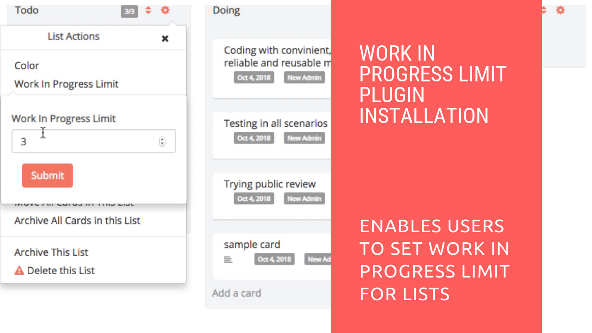

# Agile WIP Plugin Installation

## Introduction

[Restyaboard](https://restya.com/board) is an open source alternative to Trello, but with smart additional features like offline sync, diff /revisions, nested comments, multiple view layouts, chat, and more. And since it is self-hosted, data, privacy, and IP security can be guaranteed.

Restyaboard is more like an electronic sticky note for organizing tasks and todos. Apart from this, it is ideal for Kanban, Agile, Gemba board and business process/workflow management. It can be extended with [productive plugins](https://restya.com/board/apps "productive plugins")

Today, several universities, automobile companies, government organizations, etc from across Europe take advantage of Restyaboard.

This document contains information about how to install and configure Agile WIP Plugin from admin panel.

### What you'll learn

*   How to install Agile WIP Plugin
*   How to configure Agile WIP Plugin

## Video Tutorial

For step-by-step instructions on Agile WIP Plugin Installation from Admin, refer [YouTube video](https://www.youtube.com/watch?v=BR6bBZ1nkrg "Watch video on Agile WIP Plugin Installation from Admin")

## How to install Agile WIP Plugin?

1.  Download [Agile WIP app](https://restya.com/board/apps/r_agile_wip "Agile WIP app")
2.  Goto Restyaboard installation root directory. e.g., directory: `/usr/share/nginx/html/restyaboard/`
3.  Unzip the downloaded Agile WIP app within your root directory
4.  Give file permission to unzipped files located in `client/apps/r_agile_wip/` path. e.g., `chmod -R 0777 client/apps/r_agile_wip/`
5.  Execute the sql file in `client/apps/r_agile_wip/sql/` folder using the command `psql -h localhost -d {DATABASE_NAME } -U {USER_Name } -w < /usr/share/nginx/html/restyaboard/client/apps/r_agile_wip/sql/r_agile_wip.sql`
6.  Then clear the browser cache and login again to view the installed Agile WIP app on your Restyaboard.

## How to configure Agile WIP Plugin?

1.  After logging in goto board and it displays your list of cards.
2.  Then select the settings icon from the card and select List Actions.
3.  After opening List Actions enter required number of Work in Progress Limit and click submit.