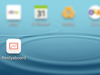

# Optimization for Android mobile

## Introduction

[Restyaboard](https://restya.com/board) is an open source alternative to Trello, but with smart additional features like offline sync, diff /revisions, nested comments, multiple view layouts, chat, and more. And since it is self-hosted, data, privacy, and IP security can be guaranteed.

Restyaboard is more like an electronic sticky note for organizing tasks and todos. Apart from this, it is ideal for Kanban, Agile, Gemba board and business process/workflow management. It can be extended with [productive plugins](https://restya.com/board/apps "productive plugins")

Today, several universities, automobile companies, government organizations, etc from across Europe take advantage of Restyaboard.

This document contains information about how Restyaboard is optimized for Android mobile.

### What you'll learn

*   How Restyaboard Optimized for Android mobile?

## Video Tutorial

For step-by-step instructions on Optimization for Android mobile from Restyaboard, refer [YouTube video](https://www.youtube.com/watch?v=ydz0y9uZbZo "Watch video on Optimization for Android mobile")

## How Restyaboard Optimized for Android mobile?

#### Restyaboard provide the ability to save a site bookmark to a device's home screen. When a site is launched this way.

1.  It has a unique icon and name so that users can distinguish it from other sites
2.  It displays something to the user while resources are downloaded or restored from cache
3.  It provides default display characterstics to the browser to avoid a too abrupt a transition when site resources become available.