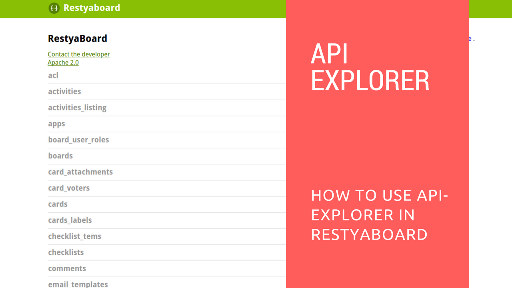

#API Explorer

## Workflow

1.  To use Restyaboard API endpoints, user must generate a "guest access token". Using this, you can access some API calls like e.g., Register, Forgot password, Login etc.,
2.  While login using user credentials, you will get "user access token". Using this you can access most of API calls like boards, lists, cards and etc., which are assigned to the loggedin user.

## Instructions

1.  To access Restyaboard through api-explorer, go to api-explorer link (http://{{YOUR\_SERVER}}/api\_explorer/) on your Restyaboard server.  
    
[http://board.demo.restya.com/api_explorer/](http://board.demo.restya.com/api_explorer/ "API Explorer")

* You can also refer the video below:

## To generate guest access token

**You can generate guest access token by simply clicking "/users" link and then by selecting "/v1/oauth.json" which is shown above and it's nothing but an api call.**  

**Further, click on "try now" button to get the guest access token, then you will get the guest access token as shown above.**

## Login with guest access token

  

1. You can login with the guest access token by clicking "/users" link and then by selecting "/v1/users/login.json" which is basically an api call.
2.  You can simply paste your generated guest access token on token parameter textbox.
3.  Further, click the 'Model Schema' to set the body parameter values.
4.  Provide your email and password to login
5.  Finally, click on the 'try now' button to login to Restyaboard. You will get the logged-in user's access token as shown below.  

Hereafter, you can access all the api calls with the logged-in user's access token
    
##### Example
    
To get your boards, click `/boards` link, select `/v1/boards.json` which is an api call.

