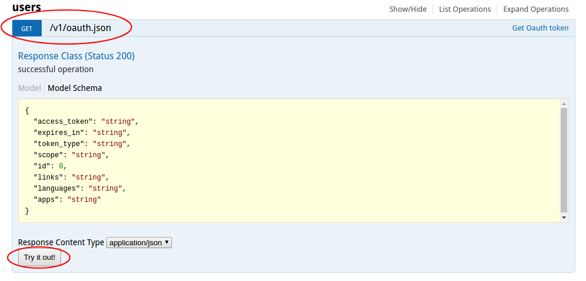
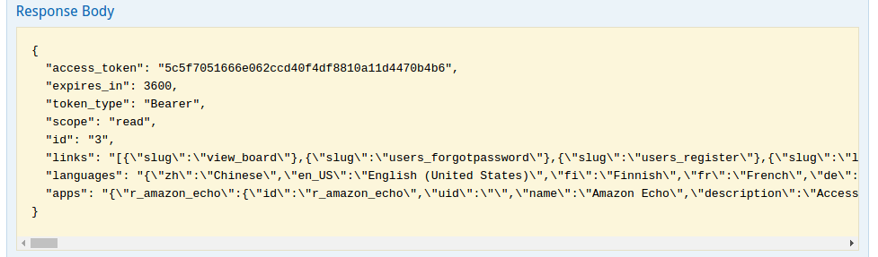
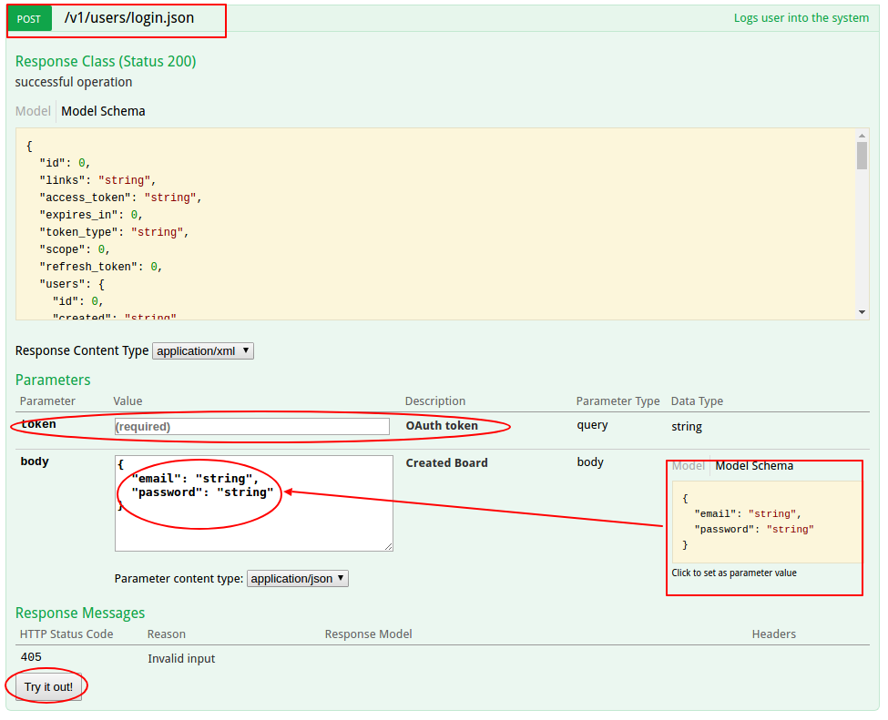
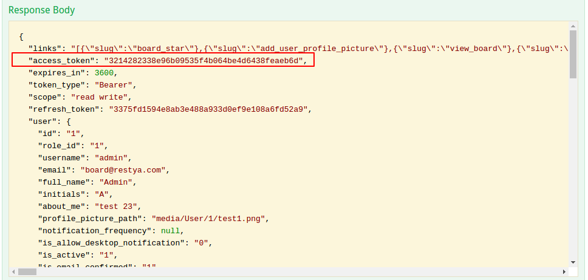
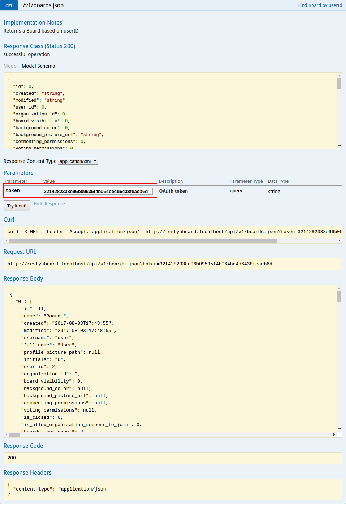

# API Explorer

## Introduction

[Restyaboard](https://restya.com/board) is an open source alternative to Trello, but with smart additional features like offline sync, diff /revisions, nested comments, multiple view layouts, chat, and more. And since it is self-hosted, data, privacy, and IP security can be guaranteed.

Restyaboard is more like an electronic sticky note for organizing tasks and todos. Apart from this, it is ideal for Kanban, Agile, Gemba board and business process/workflow management. It can be extended with [productive plugins](https://restya.com/board/apps "productive plugins")

Today, several universities, automobile companies, government organizations, etc from across Europe take advantage of Restyaboard.

This document contains information about API Explorer Help.

### What you'll learn

*   How to generate guest access token
*   How to login with guest access token

## Video Tutorial

1.  To access Restyaboard through api-explorer, go to api-explorer link (http://{{YOUR_SERVER}}/api_explorer/) on your Restyaboard server.

[http://board.demo.restya.com/api_explorer/](http://board.demo.restya.com/api_explorer/)

*   You can also refer the video below:

[![[API Explorer]](api_explorer.png "API Explorer")](https://www.youtube.com/watch?v=xKh2gRJWmfE) 

## How to generate guest access token 

 

**You can generate guest access token by simply clicking '/users' link and then by selecting '/v1/oauth.json' which is shown above and it’s nothing but an api call.** 

 

**Further, click on 'try now' button to get the guest access token, then you will get the guest access token as shown above.**  

## How to login with guest access token 

1.  You can login with the guest access token by clicking '/users' link and then by selecting '/v1/users/login.json' which is basically an api call.
2.  You can simply paste your generated guest access token on token parameter textbox.
3.  Further, click the 'Model Schema’ to set the body parameter values.
4.  Provide your email and password to login
5.  Finally, click on the 'try now’ button to login to Restyaboard. You will get the logged-in user’s access token as shown below.

 Hereafter, you can access all the api calls with the logged-in user’s access token

### Example

To get your boards, click `/boards` link, select `/v1/boards.json` which is an api call. 