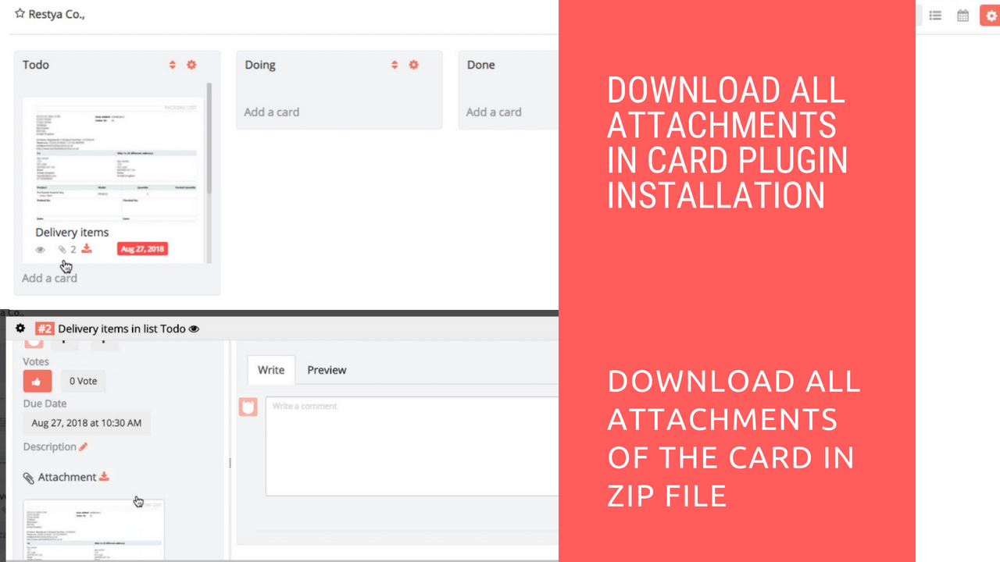

# Attachment Downloader Plugin Installation

## Introduction

[Restyaboard](https://restya.com/board) is an open source alternative to Trello, but with smart additional features like offline sync, diff /revisions, nested comments, multiple view layouts, chat, and more. And since it is self-hosted, data, privacy, and IP security can be guaranteed.

Restyaboard is more like an electronic sticky note for organizing tasks and todos. Apart from this, it is ideal for Kanban, Agile, Gemba board and business process/workflow management. It can be extended with [productive plugins](https://restya.com/board/apps "productive plugins")

Today, several universities, automobile companies, government organizations, etc from across Europe take advantage of Restyaboard.

This document contains information about how to install and configure Agile WIP Plugin from admin panel.

### What you'll learn

*   How to install Attachment Downloader Plugin
*   How to download card attachments using the Attachment Downloader Plugin

## Video Tutorial

For step-by-step instructions about Attachment Downloader Plugin Installation, refer [YouTube video](https://www.youtube.com/watch?v=e5Syqui-PhA "Watch video on Attachment Downloader Plugin Installation")

## How to install Attachment Downloader Plugin?

**Requirement**

*   `PHP ZIP` should be installed for downloading all attachments of the card in the zip file format.

**Installation Steps**

1.  Download [Attachment Downloader app](https://restya.com/board/apps/r_attachment_downloader "Attachment Downloader app")
2.  Goto Restyaboard installation root directory. e.g., directory: `/usr/share/nginx/html/restyaboard/`
3.  Unzip the downloaded Attachment Downloader app to your root directory
4.  Give file permission to unzipped files located in `client/apps/r_attachment_downloader/` path. e.g., `chmod -R 0777 client/apps/r_attachment_downloader/`
5.  Execute the `r_attachment_downloader.sql` in your Restyaboard database, located in `client/apps/r_attachment_downloader/sql/` directory
6.  Add the line `rewrite ^/download/([0-9]*)/([0-9]*)/([a-z0-9]*)$ /server/php/plugins/AttachmentDownloader/download.php?board_id=$1&card_id=$2&hash=$3 last;` after `line 23` in the `Restyaboard configuration file` which is in the `/etc/nginx/conf.d` folder and restart the `Nginx` by `systemctl restart nginx`
7.  Clear the browser cache, and login again to view the installed Attachment Downloader app on your Restyaboard.

## How to download card attachments using the Attachment Downloader Plugin

1.  If the card has the attachments, then in front of the card, there is a `Download Icon` in front of the card for downloading all attachments of the card.
2.  In the `Modal Card` page, near the `Attachment Header` there will be a `Download Icon` for downloading all attachments of the card.