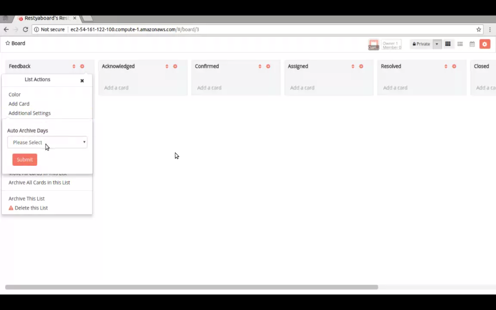

# Auto Archive Expired Cards Plugin Installation

## Introduction

[Restyaboard](https://restya.com/board) is an open source alternative to Trello, but with smart additional features like offline sync, diff /revisions, nested comments, multiple view layouts, chat, and more. And since it is self-hosted, data, privacy, and IP security can be guaranteed.

Restyaboard is more like an electronic sticky note for organizing tasks and todos. Apart from this, it is ideal for Kanban, Agile, Gemba board and business process/workflow management. It can be extended with [productive plugins](https://restya.com/board/apps "productive plugins")

Today, several universities, automobile companies, government organizations, etc from across Europe take advantage of Restyaboard.

This document contains information about how to install and configure Agile WIP Plugin from admin panel.

### What you'll learn

*   How to install Auto Archive Expired Cards Plugin
*   How to configure Auto Archive Expired Cards Plugin

## Video Tutorial

For step-by-step instructions about Auto Archive Expired Cards Plugin Installation, refer [YouTube video](https://www.youtube.com/watch?v=dVmgj_EzFsY "Watch video on Auto Archive Expired Cards Plugin Installation")

## How to install Auto Archive Expired Cards Plugin?

1.  Download [Auto Archive Expired Cards app](https://restya.com/board/apps/r_auto_archive_expired_cards "Auto Archive Expired Cards app")
2.  Goto your Restyaboard installation root directory. e.g., directory: `/usr/share/nginx/html/restyaboard/`
3.  Extract/unzip the downloaded plugin zip into the Restyaboard installation path. e.g., `/usr/share/nginx/html/restyaboard/`
4.  Give file permission to extracted files. e.g., `chmod -R 0777 client/apps/r_auto_archive_expired_cards/`
5.  Execute the sql file in `client/apps/r_auto_archive_expired_cards/sql/r_auto_archive_expired_cards.sql` using the command `sql -h localhost -d {DATABASE_NAME} -U {USER_Name} -w < /usr/share/nginx/html/restyaboard/client/apps/r_auto_archive_expired_cards/sql/r_auto_archive_expired_cards.sql`
6.  After the above process, clear the browser cache and login again to view the installed Auto Archive Expired Cards app on your Restyaboard.