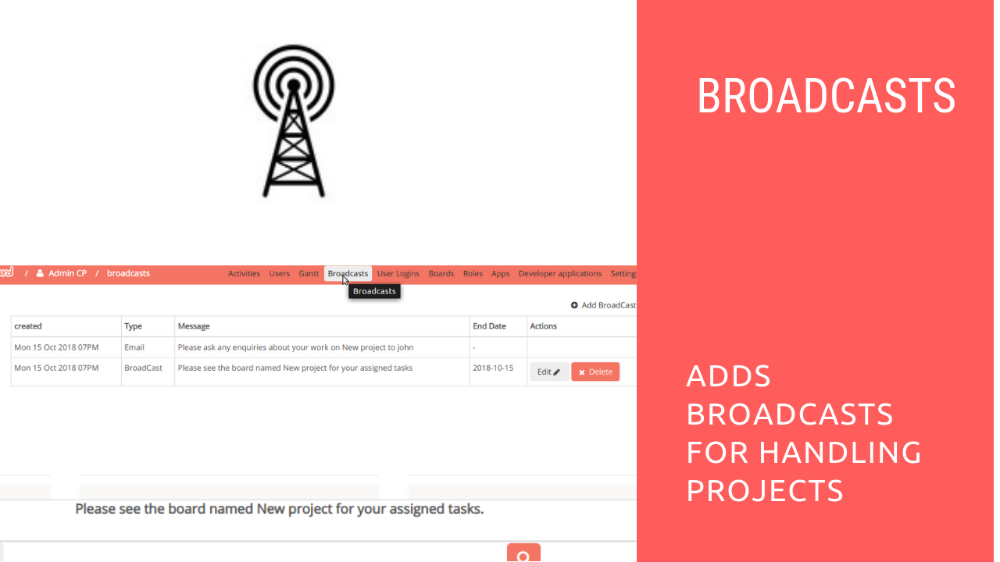

# Broadcasts Plugin Installation

## Introduction

[Restyaboard](https://restya.com/board) is an open source alternative to Trello, but with smart additional features like offline sync, diff /revisions, nested comments, multiple view layouts, chat, and more. And since it is self-hosted, data, privacy, and IP security can be guaranteed.

Restyaboard is more like an electronic sticky note for organizing tasks and todos. Apart from this, it is ideal for Kanban, Agile, Gemba board and business process/workflow management. It can be extended with [productive plugins](https://restya.com/board/apps "productive plugins")

Today, several universities, automobile companies, government organizations, etc from across Europe take advantage of Restyaboard.

This document contains information about how to install Broadcasts Plugin and how to create broadcasts from admin panel in the Restyaboard.

### What you'll learn

*   How to install Broadcasts Plugin in the Restyaboard
*   How to create the Broadcasts in the Restyaboard

## Video Tutorial

For step-by-step instructions on Broadcasts Plugin Installation from Admin, refer [YouTube video](https://www.youtube.com/watch?v=HZwlGw3XPFU "Watch video on Broadcasts Plugin Installation")

## Broadcasts Plugin Installation

1.  Download [Broadcasts WIP app](https://restya.com/board/apps/r_broadcasts "Broadcasts WIP app")
2.  Goto your Restyaboard installation root directory. e.g., directory: `/usr/share/nginx/html/restyaboard/`
3.  Extract/unzip the downloaded plugin zip into the restyaboard installation path. e.g., `/usr/share/nginx/html/restyaboard/`
4.  Give file permission to extracted files. e.g., `chmod -R 0777 client/apps/r_broadcasts/`
5.  Execute the sql file in `client/apps/r_broadcasts/sql/r_broadcasts.sql` using the command `psql -h localhost -d {DATABASE_NAME} -U {USER_Name} -w < /usr/share/nginx/html/restyaboard/client/apps/r_broadcasts/sql/r_broadcasts.sql`
6.  After the above process, clear the browser cache and login again to view the installed Broadcasts plugin on your Restyaboard.

## How to create the Broadcasts in the Restyaboard

1.  For creating Broadcasts, goto `http://{YOUR_SERVER_NAME}/#/apps/r_broadcast/broadcast?page=1` path in your Restyaboard server and click `Add Broadcast` and fill the details of broadcasts in the form and click the `add` button for submitting the broadcast.
2.  Now, the broadcasts will be created. if the broadcast type is `Email`, then it will send a broadcast message to all the users of the Restyaboard and if the broadcast type is `Broadcast`, then it will show the broadcast message above the footer content for all logged in users