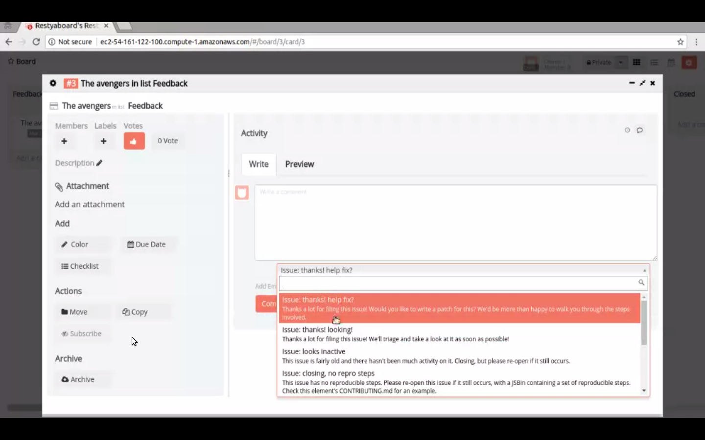

# Canned Response Plugin Installation

## Introduction

[Restyaboard](https://restya.com/board) is an open source alternative to Trello, but with smart additional features like offline sync, diff /revisions, nested comments, multiple view layouts, chat, and more. And since it is self-hosted, data, privacy, and IP security can be guaranteed.

Restyaboard is more like an electronic sticky note for organizing tasks and todos. Apart from this, it is ideal for Kanban, Agile, Gemba board and business process/workflow management. It can be extended with [productive plugins](https://restya.com/board/apps "productive plugins")

Today, several universities, automobile companies, government organizations, etc from across Europe take advantage of Restyaboard.

This document contains information about how to install and configure Canned Response Plugin from admin panel.

### What you'll learn

*   How to install Canned Response Plugin?
*   How to configure Canned Response Plugin?

## Video Tutorial

For step-by-step instructions on Canned Response Plugin Installation from Admin, refer [YouTube video](https://www.youtube.com/watch?v=ZAGgmVVHMME "Watch video on Canned Response Plugin Installation from Admin")

## How to install Canned Response Plugin?

1.  Download [Canned Response app](https://restya.com/board/apps/r_canned_response "Canned Response app")
2.  Goto your Restyaboard installation root directory. e.g., directory: `/usr/share/nginx/html/restyaboard/`
3.  Extract/unzip the downloaded plugin zip into the restyaboard installation path. e.g., `/usr/share/nginx/html/restyaboard/`
4.  Give file permission to extracted files. e.g., `chmod -R 0777 client/apps/r_canned_response/`
5.  Goto `client/apps/r_canned_response/` directory, to configure the plugin using app.json. Or You can also configure it on `http://{YOUR_SERVER_NAME}/#/apps` path in your Restyaboard server.
6.  After the above process, clear the browser cache and login again to view the installed Canned Response plugin on your Restyaboard.

## How to configure Canned Response Plugin?

1.  After logging in goto board and it displays your list of cards.
2.  Double click the card and it opens pop up window.
3.  Then select type of issue under comment section and click comment button.