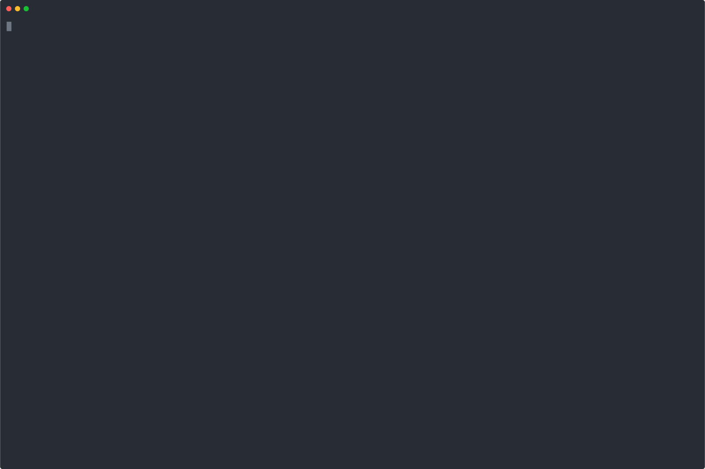

# Card Aging Plugin Installation

## Introduction

Cards on a board that haven't been touched in a long time can be seen. Cards will age noticeably with inactivity if this option is enabled.

With the Card Aging app, you can easily see which cards on your board haven't been used in a while. You can see which cards and initiatives have fallen by the wayside and need to be archived or need a status report as cards fade (Regular mode) or (Pirate mode), ensuring that the boards remain important and up-to-date.

## Video Tutorial

For step-by-step instructions on installation of Card Aging Plugin Installation in Restyaboard, refer [YouTube video](https://www.youtube.com/watch?v=cxH4JMH0Ctc "Watch video on Card Aging Plugin Installation in Restyaboard")

  

## Card Aging Plugin Installation

1.  Download [Card Aging App](https://restya.com/board/apps/r_card_aging "Card Aging App")
2.  Goto Restyaboard installation root directory.e.g., directory: `/usr/share/nginx/html/restyaboard/`
3.  Unzip the downloaded Card Aging app to your root directory
4.  Open the command prompt in `/usr/share/nginx/html/restyaboard/client/apps/r_card_aging/` path and give the executable permission to the shell file `card_aging.sh`.e.g.,`chmod +x card_aging.sh`
5.  Run the shell script file. e.g., `./card_aging.sh`
6.  Configure Card Aging on `http://{YOUR_SERVER_NAME}/#/apps/r_card_aging` path in your Restyaboard server.
7.  Clear the browser cache, and login again to view the installed Card Aging app on your Restyaboard.