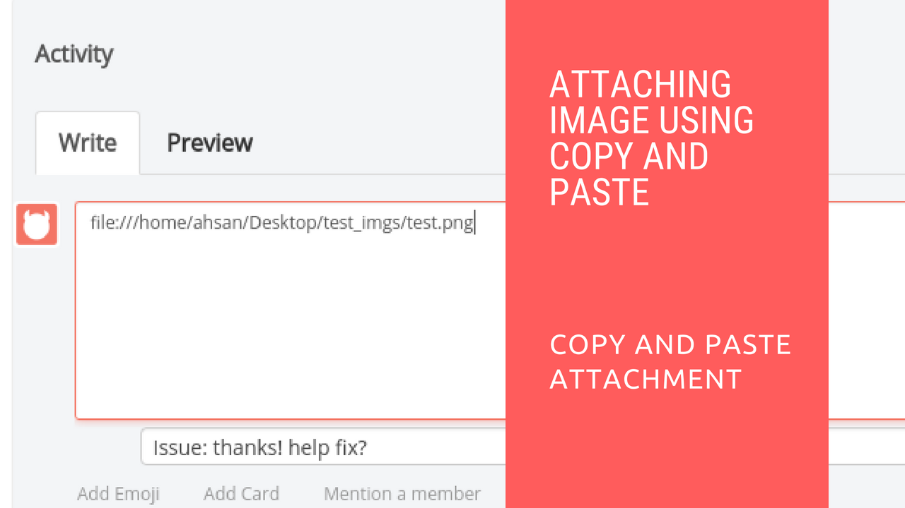

# Attaching Image in Card Using Copy and Paste in Restyaboard

## Introduction

[Restyaboard](https://restya.com/board) is an open source alternative to Trello, but with smart additional features like offline sync, diff /revisions, nested comments, multiple view layouts, chat, and more. And since it is self-hosted, data, privacy, and IP security can be guaranteed.

Restyaboard is more like an electronic sticky note for organizing tasks and todos. Apart from this, it is ideal for Kanban, Agile, Gemba board and business process/workflow management. It can be extended with [productive plugins](https://restya.com/board/apps "productive plugins")

Today, several universities, automobile companies, government organizations, etc from across Europe take advantage of Restyaboard.

This document contains information about Attaching Image in Card Using Copy and Paste in Restyaboard.

### What you'll learn

*   How to attach Image in Card Using Copy and Paste in Restyaboard?

## Video Tutorial

For step-by-step instructions on Attaching Image in Card Using Copy and Paste in Restyaboard, refer [YouTube video](https://www.youtube.com/watch?v=0N1L_mbb2wc "Watch video on Attaching Image in Card Using Copy and Paste in Restyaboard")

  

## How to attach Image in Card Using Copy and Paste in Restyaboard?

1.  Goto any one of the boards in your Restyaboard.
2.  Click any one card in the lists.
3.  Please open the image with `image viewer` (or) the `browser` and click copy and paste the `image path` in the `comment` section of the card and the `attachment` will be shown in the `attachment` section of the card.