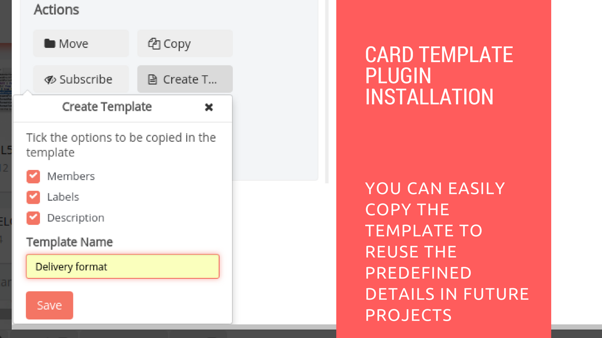

# Card Template Plugin Installation

## Introduction

[Restyaboard](https://restya.com/board) is an open source alternative to Trello, but with smart additional features like offline sync, diff /revisions, nested comments, multiple view layouts, chat, and more. And since it is self-hosted, data, privacy, and IP security can be guaranteed.

Restyaboard is more like an electronic sticky note for organizing tasks and todos. Apart from this, it is ideal for Kanban, Agile, Gemba board and business process/workflow management. It can be extended with [productive plugins](https://restya.com/board/apps "productive plugins")

Today, several universities, automobile companies, government organizations, etc from across Europe take advantage of Restyaboard.

This document contains information about how to install and configure Card Template Plugin from admin panel.

### What you'll learn

*   How to install Card Template Plugin
*   How to configure Card Template Plugin

## Video Tutorial

For step-by-step instructions on Card Template Plugin Installation from Admin, refer [YouTube video](https://www.youtube.com/watch?v=Hu9hNv9wFyQ "Watch video on Card Template Plugin Installation")

## How to install Card Template Plugin

1.  Download [Card Template app](https://restya.com/board/apps/r_card_template "Card Template app")
2.  Goto your Restyaboard installation root directory. e.g., directory: `/usr/share/nginx/html/restyaboard/`
3.  Extract/unzip the downloaded plugin zip into the restyaboard installation path. e.g., `/usr/share/nginx/html/restyaboard/`
4.  Give file permission to extracted files. e.g., 'chmod -R 0777 client/apps/r\_card\_template/'
5.  Execute the sql file `client/apps/r_card_template/sql/r_card_template.sql` using the command `psql -h localhost -d {DATABASE_NAME} -U {USER_Name} -w < /usr/share/nginx/html/restyaboard/client/apps/r_card_template/sql/r_card_template.sql`
6.  After the above process, clear the browser cache and login again to view the installed Card Template plugin on your Restyaboard.

## How to configure Card Template Plugin?

1.  After logging in goto board and it displays your list of cards.
2.  Double click the card and it opens pop up window.
3.  Then click create template button and select the checkboxes.
4.  And then enter the Template name and click the save button.