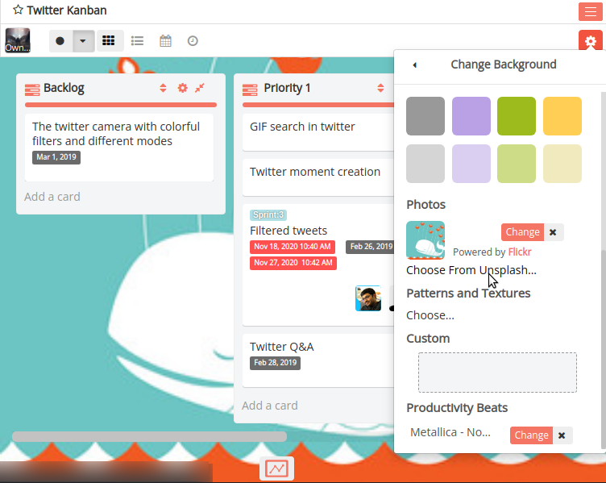
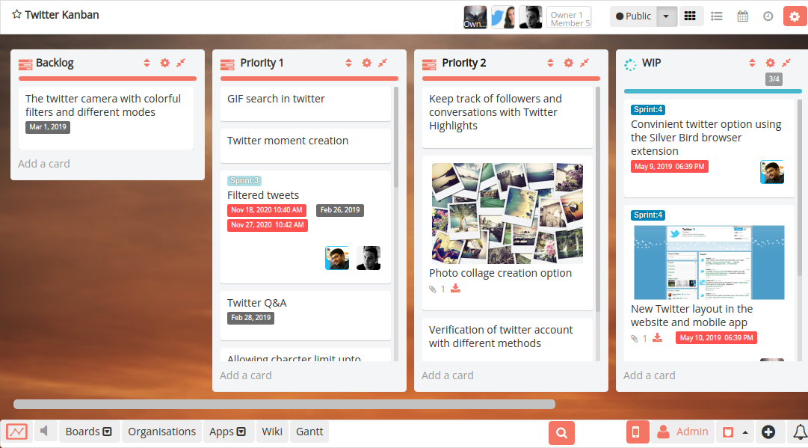

# Changing the background of the board 

You can change the background of your Restyaboard boards to make them more personal. Once you've updated the board backdrop, it will be visible to all other users who visit the board. Choose from thirty-two different colors or attractive photographs to express yourself while also making it easier to navigate your board's page. Additionally, users can upload their own background photos.

## Changing your board's background

To change your board's background, go to the board menu on the right side of your board, and select "Change Background". You can then choose your board background.

## Changing your board's background with Unsplash images

You'll notice a new menu after clicking "Change Background," where you can choose between a solid color background and a photo. Choose from one of our solid-color selections under "Colors," or browse through amazing high-resolution images from Unsplash under "Photos."

You can search for photos from Unsplash.

Once you've found an image you like, click it to apply it to your board, and then relax and enjoy your new board background!

