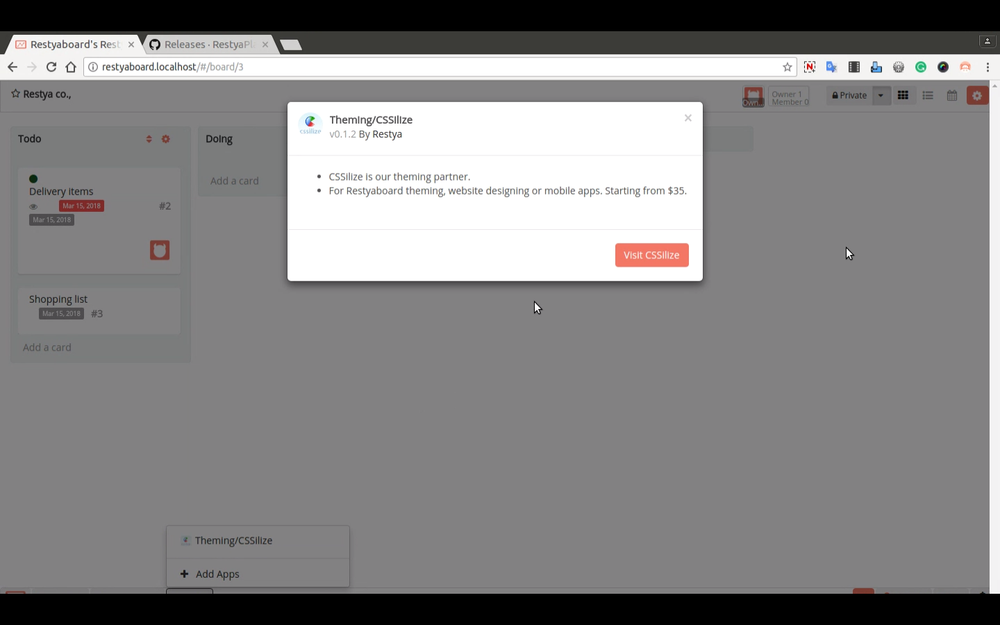

# Theming/CSSilize Plugin Installation

## Introduction

[Restyaboard](https://restya.com/board) is an open source alternative to Trello, but with smart additional features like offline sync, diff /revisions, nested comments, multiple view layouts, chat, and more. And since it is self-hosted, data, privacy, and IP security can be guaranteed.

Restyaboard is more like an electronic sticky note for organizing tasks and todos. Apart from this, it is ideal for Kanban, Agile, Gemba board and business process/workflow management. It can be extended with [productive plugins](https://restya.com/board/apps "productive plugins")

Today, several universities, automobile companies, government organizations, etc from across Europe take advantage of Restyaboard.

This document contains information about Theming/CSSilize Plugin Installation from admin panel in Restyaboard.

### What you'll learn

*   How to install Theming/CSSilize Plugin?

## Video Tutorial

For step-by-step instructions on Theming/CSSilize Plugin Installation from Admin, refer [YouTube video](https://www.youtube.com/watch?v=BR6bBZ1nkrg "Watch video on Theming/CSSilize Plugin Installation from Admin")

  

## How to install Theming/CSSilize Plugin Installation?

1.  Download the plugin from [https://github.com/RestyaPlatform/board-apps/releases](https://github.com/RestyaPlatform/board-apps/releases "App Release"), and choose the latest version and copy the link address `https://github.com/RestyaPlatform/board-apps/releases/download/v1/r_cssilize-v0.1.3.zip`
2.  Goto your Restyaboard installation root directory. e.g., directory: `/usr/share/nginx/html/restyaboard/`
3.  Then goto `client/apps` directory and get the zip file by typing the command `wget {plugin_link}` in the command prompt
4.  Extract/unzip the plugin zip and give file permission to extracted files. e.g., `chmod -R 0777 r_cssilize/`
5.  After the above process, clear the browser cache and login again to view the installed Theming/CSSilize plugin on your Restyaboard.