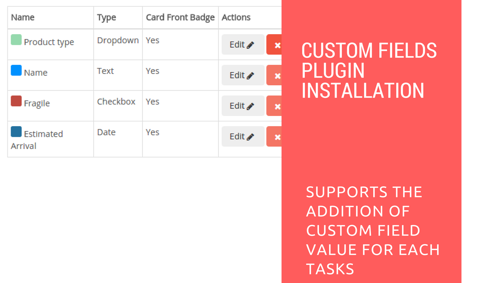

# Custom Field Plugin Installation

## Introduction

[Restyaboard](https://restya.com/board) is an open source alternative to Trello, but with smart additional features like offline sync, diff /revisions, nested comments, multiple view layouts, chat, and more. And since it is self-hosted, data, privacy, and IP security can be guaranteed.

Restyaboard is more like an electronic sticky note for organizing tasks and todos. Apart from this, it is ideal for Kanban, Agile, Gemba board and business process/workflow management. It can be extended with [productive plugins](https://restya.com/board/apps "productive plugins")

Today, several universities, automobile companies, government organizations, etc from across Europe take advantage of Restyaboard.

This document contains information about how to install Custom Field Plugin from admin panel and how to create Custom Field in Restyaboard

### What you'll learn

*   How to install Custom Field Plugin
*   How to create Custom Field

## Video Tutorial

For step-by-step instructions on Custom Field Plugin Installation, refer [YouTube video](https://www.youtube.com/watch?v=xCf4Thk3AmA "Watch video on Custom Field Plugin Installation")

## How to install Custom Field Plugin

1.  Download [Custom Field app](https://restya.com/board/apps/r_custom_fields "Custom Field app")
2.  Goto your Restyaboard installation root directory. e.g., directory: `/usr/share/nginx/html/restyaboard/`
3.  Extract/unzip the downloaded plugin zip into the restyaboard installation path. e.g., `/usr/share/nginx/html/restyaboard/`
4.  Give file permission to extracted files. e.g., `chmod -R 0777 client/apps/r_custom_fields/`
5.  Execute the sql file in `client/apps/r_custom_fields/sql/r_custom_fields.sql` using the command `psql -h localhost -d {DATABASE_NAME} -U {USER_Name} -w < /usr/share/nginx/html/restyaboard/client/apps/r_custom_fields/sql/r_custom_fields.sql`
6.  After the above process, clear the browser cache and login again to view the installed Custom Field plugin on your Restyaboard.

## How to create Custom Field

1.  For creating custom field, goto `http://{YOUR\_SERVER\_NAME}/#/apps/r_custom_fields/manage` path in your Restyaboard server and click `Add Field` and fill the details of custom field in the form and check the `Card Front Badge` checkbox for showing the custom field value in front of the card and then click `Add`
2.  Now, the custom fields will be created. Goto any particular `board` page and click any `card`, you can see the `custom field button` in the `modal card` and click the custom field button and give information to the custom field form and click `save`
3.  Now, the custom field value will be shown in the modal card and if you check the `Card Front Badge` checkbox on the custom field, then it will be shown in front of the card