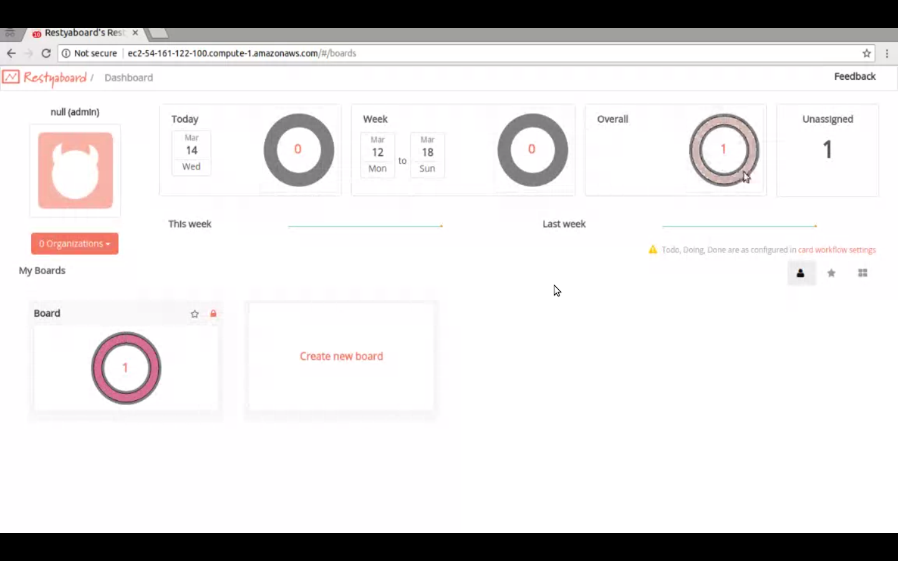

# Dashboard Charts plugin installation instructions

## Introduction

[Restyaboard](https://restya.com/board) is an open source alternative to Trello, but with smart additional features like offline sync, diff /revisions, nested comments, multiple view layouts, chat, and more. And since it is self-hosted, data, privacy, and IP security can be guaranteed.

Restyaboard is more like an electronic sticky note for organizing tasks and todos. Apart from this, it is ideal for Kanban, Agile, Gemba board and business process/workflow management. It can be extended with [productive plugins](https://restya.com/board/apps "productive plugins")

Today, several universities, automobile companies, government organizations, etc from across Europe take advantage of Restyaboard.

This document contains information about how to install and configure Dashboard Charts Plugin from admin panel.

### What you'll learn

*   How to install Dashboard Charts Plugin
*   How to configure Dashboard Charts Plugin

## Video Tutorial

For step-by-step instructions on Dashboard Charts Plugin Installation, refer [YouTube video](https://www.youtube.com/watch?v=FSrQWPgiKkM "Watch video on Dashboard Charts Plugin Installation")

## Dashboard Charts Plugin Installation

1.  Download [Dashboard Charts app](https://restya.com/board/apps/r_chart "Dashboard Charts app")
2.  Goto your Restyaboard installation root directory. e.g., directory: `/usr/share/nginx/html/restyaboard/`
3.  Extract/unzip the downloaded plugin zip into the restyaboard installation path. e.g., `/usr/share/nginx/html/restyaboard/`
4.  Give file permission to extracted files. e.g., `chmod -R 0777 client/apps/r_chart/`
5.  Goto `client/apps/r_chart/` directory, to configure the plugin using app.json. Or You can also configure it on `http://{YOUR_SERVER_NAME}/#/apps/r_chart` path in your Restyaboard server.
6.  After the above process, clear the browser cache and login again to view the installed Dashboard Charts plugin on your Restyaboard.

## Configure Dashboard Charts Plugin

1.  After logging in goto Dashboard and select card workflow settings.
2.  Then customize your required settings and click the update button.
3.  After updating the settings you can see the changes in your cards.