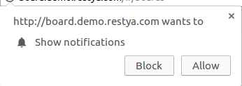
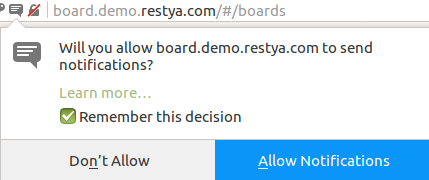
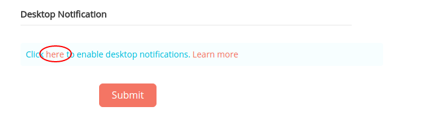
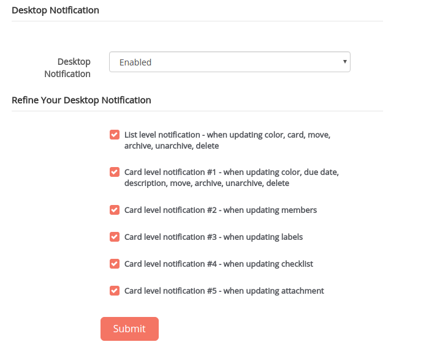
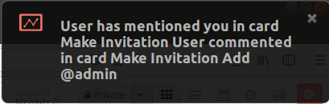
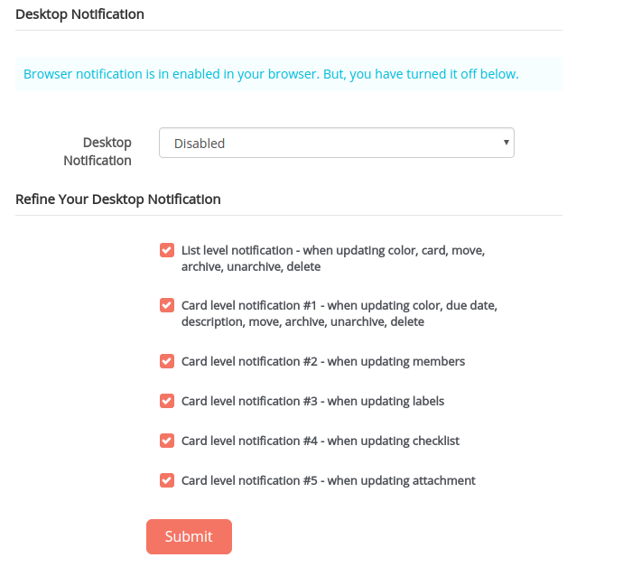
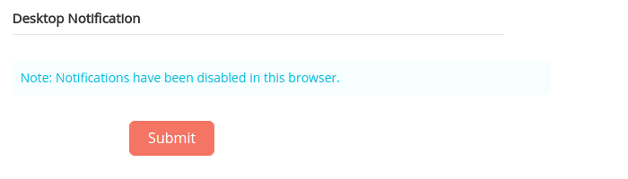
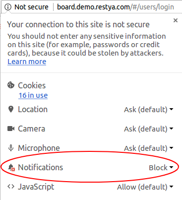
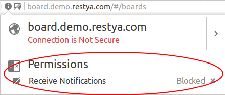

# Desktop Notifications

## Introduction

[Restyaboard](https://restya.com/board) is an open source alternative to Trello, but with smart additional features like offline sync, diff /revisions, nested comments, multiple view layouts, chat, and more. And since it is self-hosted, data, privacy, and IP security can be guaranteed.

Restyaboard is more like an electronic sticky note for organizing tasks and todos. Apart from this, it is ideal for Kanban, Agile, Gemba board and business process/workflow management. It can be extended with [productive plugins](https://restya.com/board/apps "productive plugins")

Today, several universities, automobile companies, government organizations, etc from across Europe take advantage of Restyaboard.

This document contains information about how to use, enable Desktop Notifications in Restyaboard.

### What you'll learn

*   How to use Desktop Notifications
*   How to enable Desktop notification on user profile page
*   How to allow Notification on user profile page
*   How to show Notifications for other user actions
*   How to disable desktop Notification
*   How to Blocking Notification

## Desktop Notifications

Browser will ask about this notifications in every page.

**In Chrome browser**  
  

**In Firefox browser**  

## Enabling Desktop notification on user profile page

**Also You can enable the desktop notification on user profile page .**

## Allowing Notification on user profile page

**If you select allow, then the following details will be display on the user profile page.**

## Shows Notifications for other user actions

**If you have enabled the notification, you will recieve the notifications about other users action in card, list. you will recieve the notification about members mentioning in the card also.**

## After disabling desktop Notification

**If you select allow and disabled desktop notification, then the following details will be display.**

## Blocking Notification
**If you select block, then the following details will be display.**

**Once you blocked the Desktop notifications, you can revert back by clicking site informations which is in left side top corner on your browser**

#### In Chrome browser

#### In Firefox browser
  
