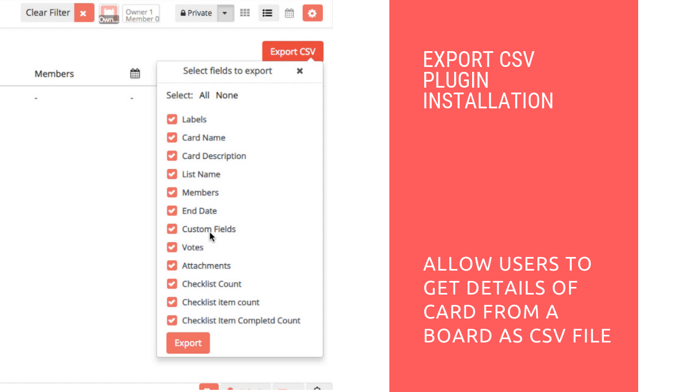

# Export CSV Plugin Installation

## Introduction

[Restyaboard](https://restya.com/board) is an open source alternative to Trello, but with smart additional features like offline sync, diff /revisions, nested comments, multiple view layouts, chat, and more. And since it is self-hosted, data, privacy, and IP security can be guaranteed.

Restyaboard is more like an electronic sticky note for organizing tasks and todos. Apart from this, it is ideal for Kanban, Agile, Gemba board and business process/workflow management. It can be extended with [productive plugins](https://restya.com/board/apps "productive plugins")

Today, several universities, automobile companies, government organizations, etc from across Europe take advantage of Restyaboard.

This document contains information about how to install Export CSV Plugin.

### What you'll learn

*   How to install the Export CSV plugin in the Restyaboard
*   How to export all the cards details of the board in CSV file

## Video Tutorial

For step-by-step instructions on Export CSV Plugin Installation, refer [YouTube video](https://www.youtube.com/watch?v=Ykey0itk49o "Watch video on Export CSV Plugin Installation")

## Export CSV Plugin Installation

1.  Download [Export CSV app](https://restya.com/board/apps/r_export_csv "Export CSV app")
2.  Goto your Restyaboard installation root directory. e.g., directory:`/usr/share/nginx/html/restyaboard/`
3.  Extract/unzip the downloaded plugin zip into the restyaboard installation path. e.g.,`usr/share/nginx/html/restyaboard/`
4.  Give file permission to extracted files. e.g.,`chmod -R 0777 client/apps/r_export_csv/`
5.  After the above process, clear the browser cache and login again to view the installed `Export CSV` plugin on your Restyaboard.

## How to export all the cards details of the board in CSV file

1.  For exporting csv files for particular cards, goto any board page and goto list view and you can see the `Export CSV` button.
2.  Goto the board header settings menu and click the `Filter cards` option and filter the cards based on the label or member or card color.
3.  Now you can export the filtered cards details of the board by clicking the `Export` button in the Export CSV button dropdown menu