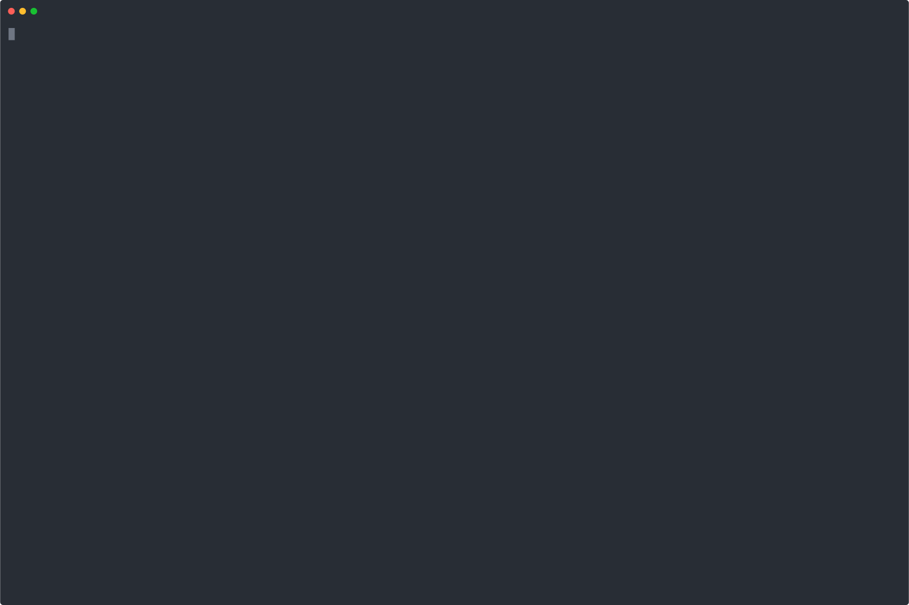

# Freshdesk Plugin Installation

## Introduction

[Restyaboard](https://restya.com/board) is an open source alternative to Trello, but with smart additional features like offline sync, diff /revisions, nested comments, multiple view layouts, chat, and more. And since it is self-hosted, data, privacy, and IP security can be guaranteed.

Restyaboard is more like an electronic sticky note for organizing tasks and todos. Apart from this, it is ideal for Kanban, Agile, Gemba board and business process/workflow management. It can be extended with [productive plugins](https://restya.com/board/apps "productive plugins")

Today, several universities, automobile companies, government organizations, etc from across Europe take advantage of Restyaboard.

This document contains information about how to install and use Freshdesk app in Restyaboard.

### What you'll learn

*   How to install Freshdesk app in Restyaboard

## Video Tutorial

For step-by-step instructions on installation and usage of Freshdesk Plugin Installation in Restyaboard, refer [YouTube video](https://www.youtube.com/watch?v=2cUbKshwRwg "Watch video on Freshdesk Plugin Installation in Restyaboard")

## Freshdesk Plugin Installation

1.  Download [Freshdesk App](https://restya.com/board/apps/r_freshdesk "Freshdesk App")
2.  Goto Restyaboard installation root directory.e.g., directory: `/usr/share/nginx/html/restyaboard/`
3.  Unzip the downloaded Freshdesk app to your root directory
4.  Open the command prompt in `/usr/share/nginx/html/restyaboard/client/apps/r_freshdesk/` path and give the executable permission to the shell file `freshdesk.sh`.e.g.,`chmod +x freshdesk.sh`
5.  Run the shell script file. e.g., `./freshdesk.sh`
6.  Clear the browser cache, and login again to view the installed Freshdesk app on your Restyaboard.