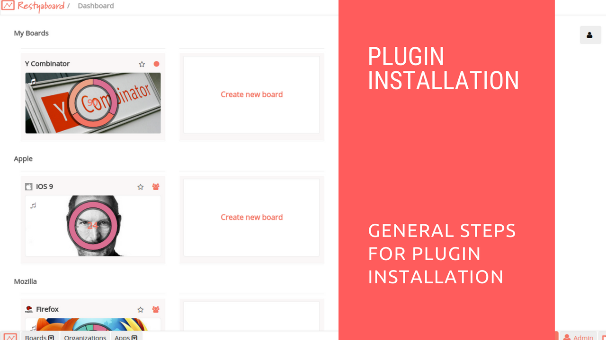

# General Plugin Installation

## Introduction

[Restyaboard](https://restya.com/board) is an open source alternative to Trello, but with smart additional features like offline sync, diff /revisions, nested comments, multiple view layouts, chat, and more. And since it is self-hosted, data, privacy, and IP security can be guaranteed.

Restyaboard is more like an electronic sticky note for organizing tasks and todos. Apart from this, it is ideal for Kanban, Agile, Gemba board and business process/workflow management. It can be extended with [productive plugins](https://restya.com/board/apps "productive plugins")

Today, several universities, automobile companies, government organizations, etc from across Europe take advantage of Restyaboard.

This document contains information about General Instructions for Plugin Configuration and Instructions for Specific Plugin Configuration.

### What you'll learn

*   How to install Plugin in the Restyaboard
*   How to configure Plugin in the Restyaboard

## Video Tutorial

For step-by-step instructions on General Instructions for Plugin Configuration, refer [YouTube video](https://www.youtube.com/watch?v=AWqxxY9zG7g "Watch video on General Instructions for Plugin Configuration")

## General Instructions for Plugin Configuration

1.  Download [apps](https://restya.com/board/apps "Apps")
2.  Goto your Restyaboard installation root directory. e.g., directory: `/usr/share/nginx/html/restyaboard/`
3.  Extract/unzip the downloaded plugin zip into the Restyaboard installation path. e.g., `/usr/share/nginx/html/restyaboard/`
4.  Give file permission to extracted files. e.g., If you download the Dashboard charts plugin then you need to give file permission extracted files which are in `client/apps/r_chart/` path. e.g., `chmod -R 0777 client/apps/r_chart/`
5.  Run the sql file in the apps sql folder.
6.  Goto `http://{YOUR_SERVER_NAME}/#/apps/{YOUR_PLUGIN}` path in your Restyaboard server to configure the plugin.
7.  After the above process, clear the browser cache and login again to view the installed plugins on your Restyaboard.

## Instructions for Specific Plugin Configuration

1.  Some plugins are having shell script to install its required software. e.g., Elasticsearch and Chat. For Elasticsearch plugin, elasticsearch.sh file wrapped with zip and for Chat plugins, chat.sh file wrapped with zip
2.  It’ll be available on your Restyaboard root directory after extracted the plugin zip. And also give permission to that script file using `chmod +x {SHELL_SCRIPT_FILE}`
3.  Execute the script file on terminal using `./{SHELL_SCRIPT_FILE}`
4.  After the above process, clear the browser cache and login again to view the installed plugins on your Restyaboard.
