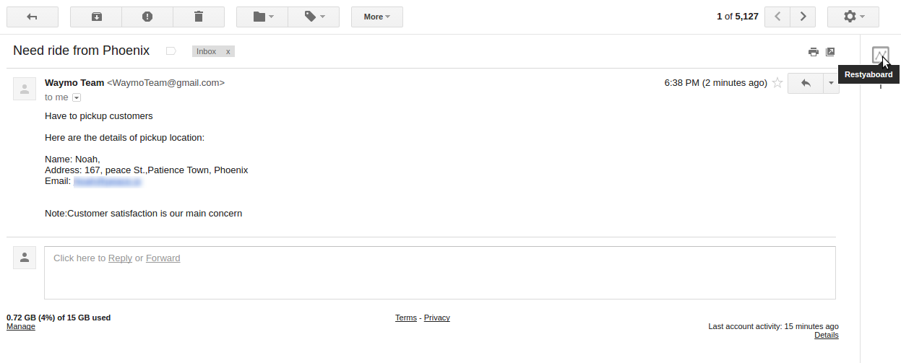
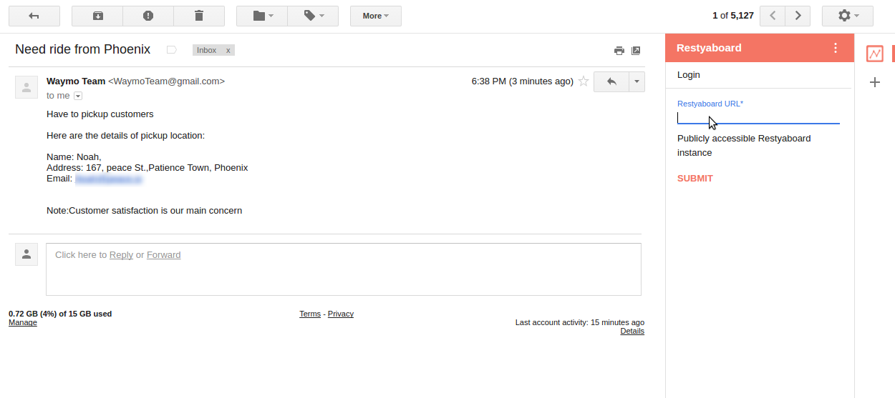
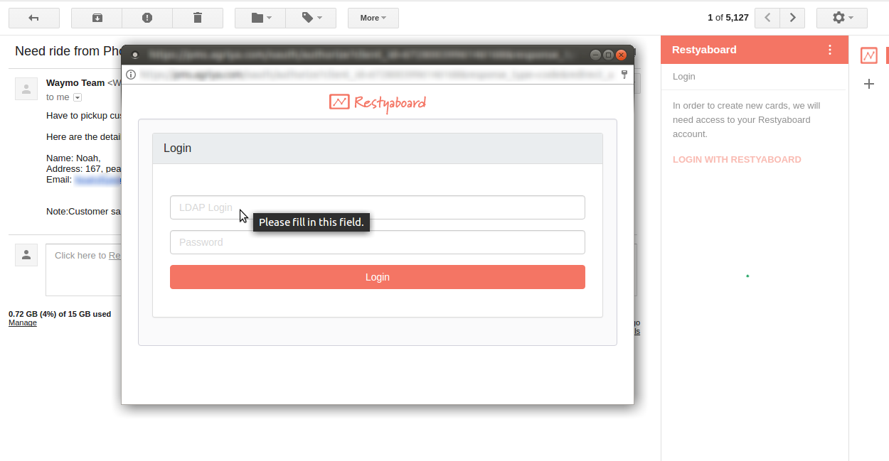
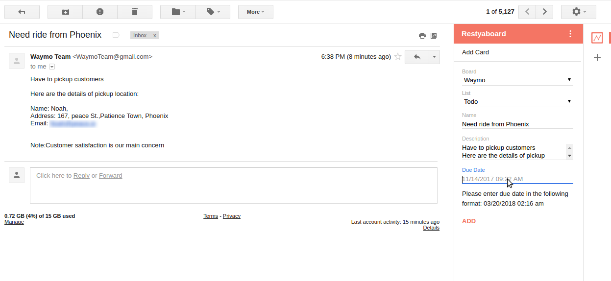
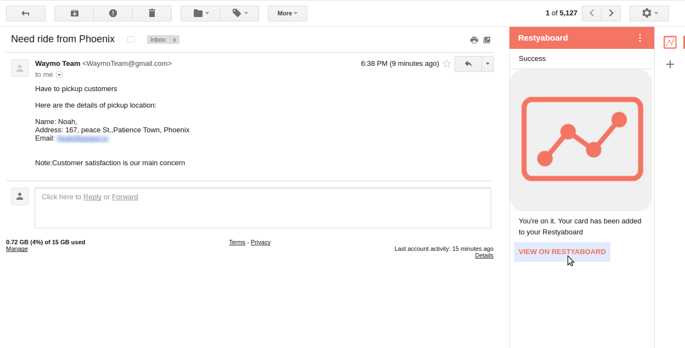
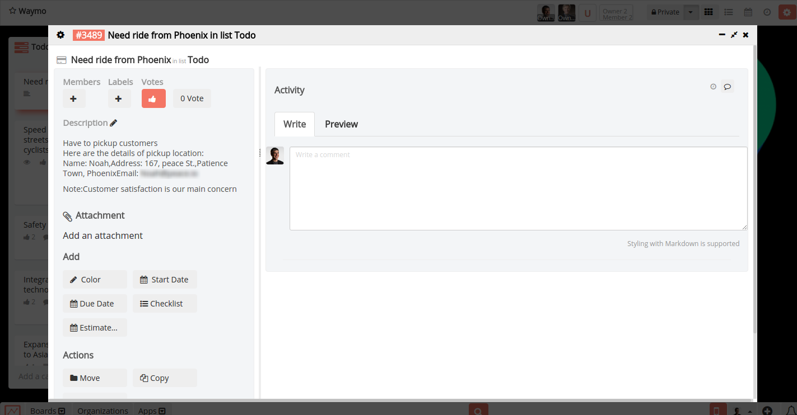
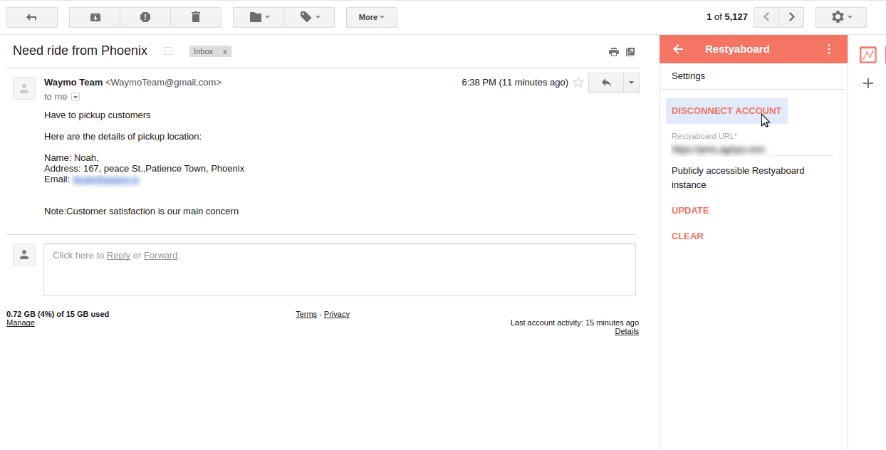
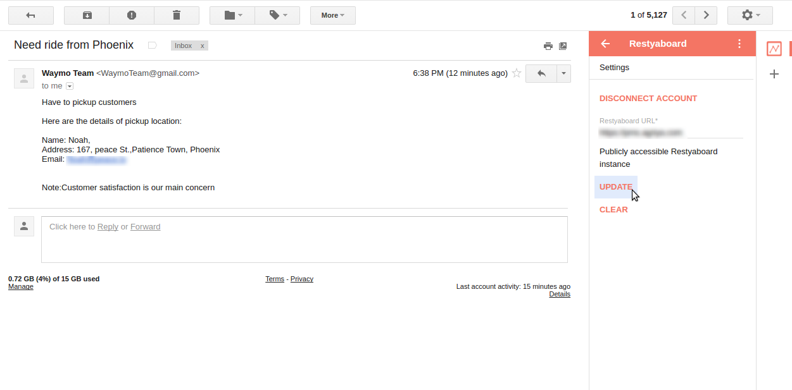
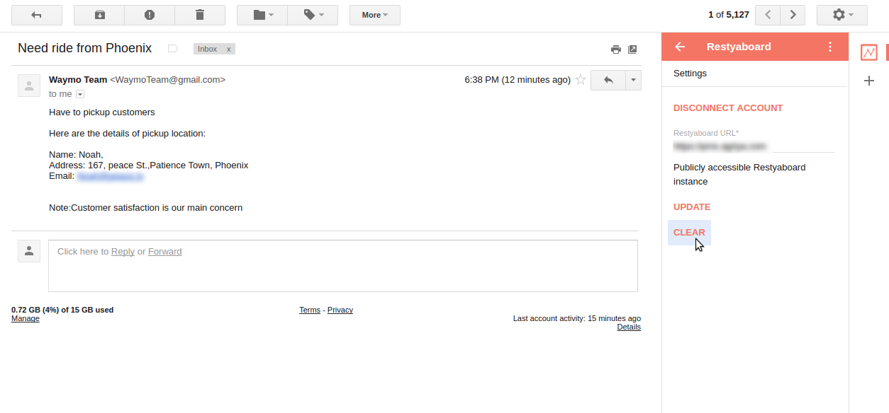

# Gmail add-on

## Introduction

[Restyaboard](https://restya.com/board) is an open source alternative to Trello, but with smart additional features like offline sync, diff /revisions, nested comments, multiple view layouts, chat, and more. And since it is self-hosted, data, privacy, and IP security can be guaranteed.

Restyaboard is more like an electronic sticky note for organizing tasks and todos. Apart from this, it is ideal for Kanban, Agile, Gemba board and business process/workflow management. It can be extended with [productive plugins](https://restya.com/board/apps "productive plugins")

Today, several universities, automobile companies, government organizations, etc from across Europe take advantage of Restyaboard.

This document contains information about how to install the Restyaboard Gmail Add-on in your mail.

### What you'll learn

*   How install the Restyaboard Gmail Add-on in your mail

## Overview

**Description**

* Access your Restyaboard account from your mail inbox and increase the productivity.

**Features / Benefits**

* New, innovative feature that helps you to make todo's list from your mail inbox itself.
* Saves time and effort by creating card with email subject as card title and email bodies as card description.
* Helps to achieve full productivity and reduce effort.
* Gmail Add-on makes your life more convenient.
* Helps to make todo's list as card from email and we can add this card to any lists in any board of Restyaboard

**Requirement**

* The Restyaboard URL should be "publicly accessible instance".
* Please contact us and give us your "Restyaboard URL" and we will add it in the script.

**How to use**

* Click any email to use the Gmail Add-on and click on Add-on.

  

* Give the Restyaboard URL which you have account and click submit.

  

* If the URL is valid it will lead to Login or it will lead to contact us page.

  

* Now give your account credentials to Login.

  

* After Login allow the add-on to read your email.

  

* Now you can create the card with email subject as card title and email body as card description and we can create the card in any lists in any boards.
* You can also add the due date to the card.

  

* Now after creating card with email details you can go to the card page by clicking View on Restyaboard button.

  

* Now the card page will be opened on the new tab.

  

* If you want to disconnect the account then click Disconnect Account button in the Settings and this wll lead to Login.

  

* If you want to use another Restyaboard URL at the email after given one url,you can give the new url in Restyaboard Url of settings.
* Then click update button to use the new Restyaboard URL,If the url is allowed then it will be updated or it will lead to contact us page.

  

* If you want to clear the given Restyaboard URL then click clear in the settings ,then it will ask you to enter the new Restyaboard URL.

  

## What do I Need?

**What do I Need?**
* A convenient assistant that make your life easy by accessing your account from email.
* Help you to never miss a thing from email by creating a card with email subject as title and email body as card description.
* Provide users total and intuitive content over what the user email contains.

## My Problems

**My Problems**
* Lack of time due to card creation for important work related details that are contained as email.
* Hard to keep the information from email and write it down in the card as description or title.
* Hard to assign due date for the cards which have the details from email.

## Installation Steps

**Installation Steps**

*   Give us your url by contact us

[https://restya.com/contact](https://restya.com/contact)

*   Download [Gmail Add-on app](https://restya.com/board/apps/r_gmail_addon "Gmail Add-on app").

## FAQs

**FAQs**

* Can I set up custom field for a particular card?
  *   The options will be added in the future.