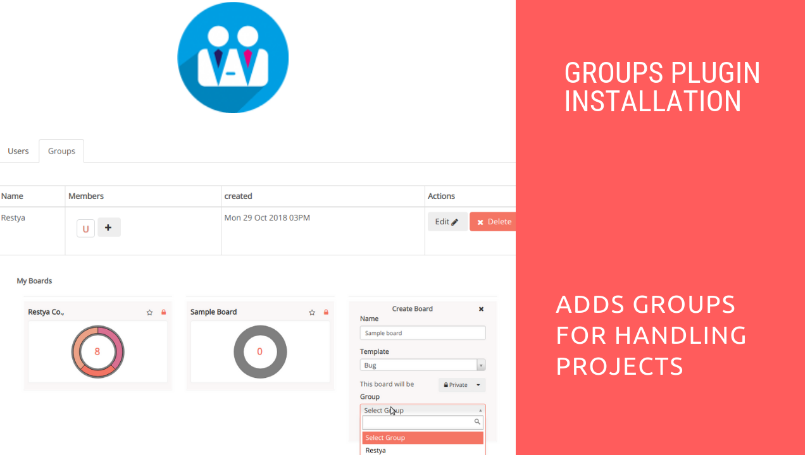

# Groups Plugin Installation

## Introduction

[Restyaboard](https://restya.com/board) is an open source alternative to Trello, but with smart additional features like offline sync, diff /revisions, nested comments, multiple view layouts, chat, and more. And since it is self-hosted, data, privacy, and IP security can be guaranteed.

Restyaboard is more like an electronic sticky note for organizing tasks and todos. Apart from this, it is ideal for Kanban, Agile, Gemba board and business process/workflow management. It can be extended with [productive plugins](https://restya.com/board/apps "productive plugins")

Today, several universities, automobile companies, government organizations, etc from across Europe take advantage of Restyaboard.

This document contains information about Groups Plugin Installation and Creation of Groups.

### What you'll learn

*   How to install Groups Plugin in the Restyaboard?
*   How to create Groups in the Restyaboard?

## Video Tutorial

For step-by-step instructions on Groups Plugin Installation, refer [YouTube video](https://www.youtube.com/watch?v=Se6LzBGnSV4 "Watch video on Groups Plugin Installation")

## Groups Plugin Installation

1.  Download [Groups app](https://restya.com/board/apps/r_groups "Groups app")
2.  Goto your Restyaboard installation root directory. e.g., directory:`/usr/share/nginx/html/restyaboard/`
3.  Extract/unzip the downloaded plugin zip into the restyaboard installation path. e.g.,`usr/share/nginx/html/restyaboard/`
4.  Give file permission to extracted files. e.g.,`chmod -R 0777 client/apps/r_groups/`
5.  Execute the sql file in `client/apps/r_groups/sql` folder using the command `psql -h localhost -d {DATABASE_NAME} -U {USER_Name} -w < /usr/share/nginx/html/restyaboard/client/apps/r_groups/sql/r_groups.sql`
6.  After the above process, clear the browser cache and login again to view the installed `Groups` plugin on your Restyaboard.

## Creation of Groups

1.  For creating Groups, goto`http://{YOUR\_SERVER\_NAME}/#/users` path in your Restyaboard server and in the content of the `Groups` tab, list of groups will be listed with group users
2.  Now, for creating the groups , please click the Add Group button and submit the form
3.  You can add the group users while creating the board or organization by selecting the group