# Hangouts Chat bot

## Introduction

[Restyaboard](https://restya.com/board) is an open source alternative to Trello, but with smart additional features like offline sync, diff /revisions, nested comments, multiple view layouts, chat, and more. And since it is self-hosted, data, privacy, and IP security can be guaranteed.

Restyaboard is more like an electronic sticky note for organizing tasks and todos. Apart from this, it is ideal for Kanban, Agile, Gemba board and business process/workflow management. It can be extended with [productive plugins](https://restya.com/board/apps "productive plugins")

Today, several universities, automobile companies, government organizations, etc from across Europe take advantage of Restyaboard.

This document contains information about how to install and use the Restyaboard Hangouts Chat bot.

### What you'll learn

*   How to install the Restyaboard Hangouts Chat bot
*   How to use the Restyaboard Hangouts Chat bot

## Overview

**Description**

* Access your Restyaboard account by interacting with Hangouts Chat bot and increase the productivity.

**Features / Benefits**

* New, innovative feature that helps you to create cards or create labels  by interacting with Hangouts Chat bot itself.
* Saves time and effort by creating card with given text as card name and you can set the labels to the card.
* Helps to achieve full productivity and reduce effort..
* Hangouts chat bot makes your life more convenient.
* Helps to make todo's list as card in Restyaboard by interacting with Hangouts Chat bot.

**Requirement**

* The Restyaboard URL should be "publicly accessible instance".
* Please contact us and give us your "Restyaboard URL" and we will add it in the script.

**How to use**

* Add a Hangouts chat bot to the room or you can directly interact with Hangouts chat bot and it will response with welcome card message.
* Please click the search bar in the left side and it will provide option for direct message with the Hangouts chat bot and create room and add Hangouts chat bot.

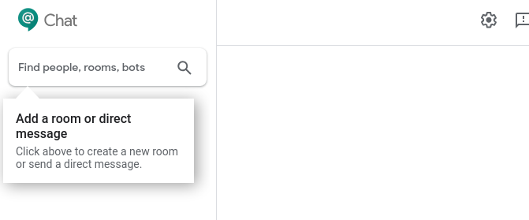  

* If you want to directly message the Hangouts chat bot, please select 'message with a bot' option .

  

* Type the Hangouts chat bot name and the chat bot will be listed and you can message it by clicking 'message'.

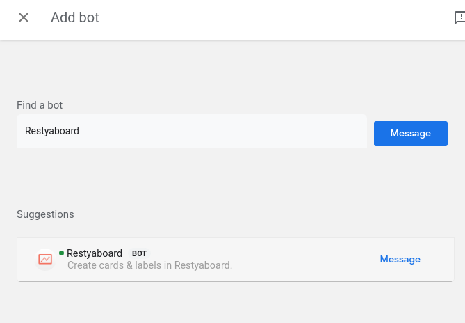  

* Now, it will response with welcome card message.

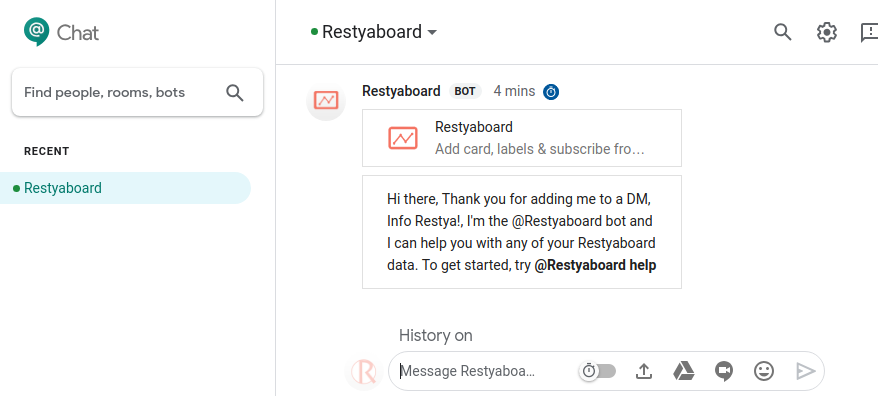  

* If you want to create a room with people and to add the Hangouts chat bot, we have to create a room by clicking 'create room' option.

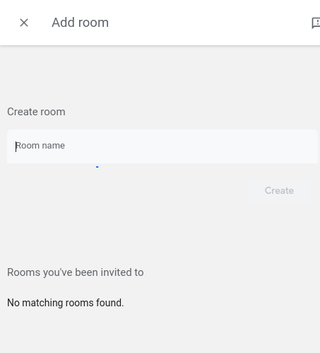  

* Type the 'Room name' and click 'create' for creating a room.

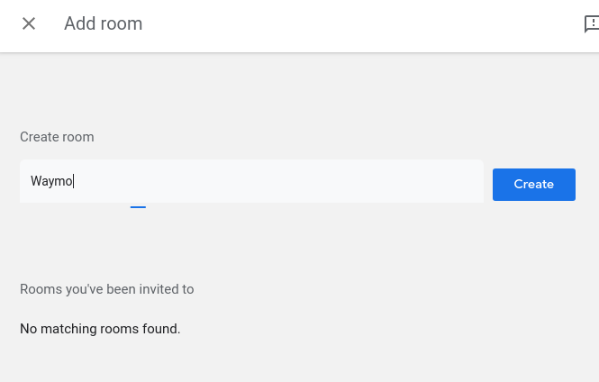  

* You can add the Hangouts chat bot to the room by clicking the room name and click "Add people & bots" option.

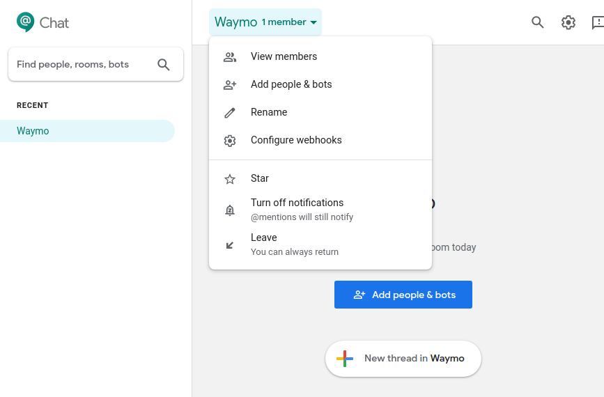  

* Type the Hangouts chat bot name and the chat bot will be listed and you can select the bot by pressing 'enter'.

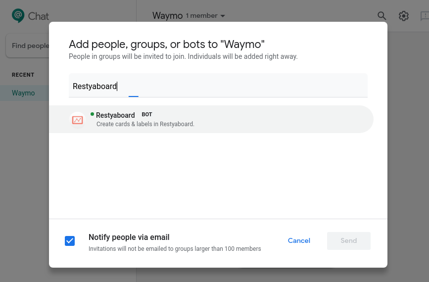  

* Click 'Add' for adding the Hangouts chat bot to the room.

  

* Now, the Hangout chat bot is added to the room and it will response with welcome card message.

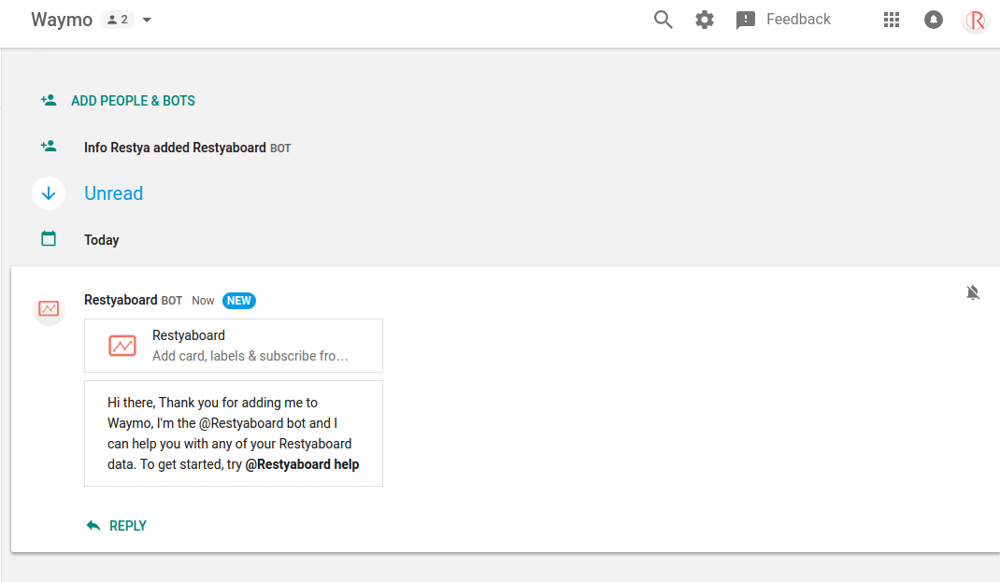

* If you need any help regarding how to use hangout chat bot, you can type as '@Restyaboard help' and the bot will reply with list of comments and their uses.

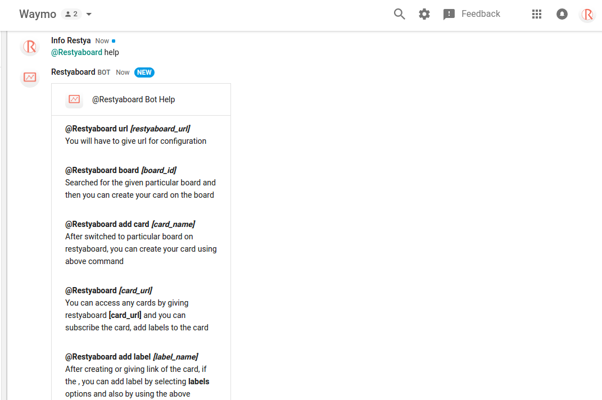

* Give the Restyaboard URL which you have account by typing '@Restyaboard url {restyaboard_instance}' and if the given restyaboard_instance is valid, it will response with caonfigure card message and click configure.

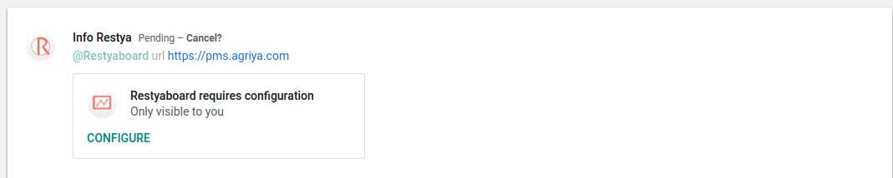

* Now it will lead to Login page and give your account credentials to Login.

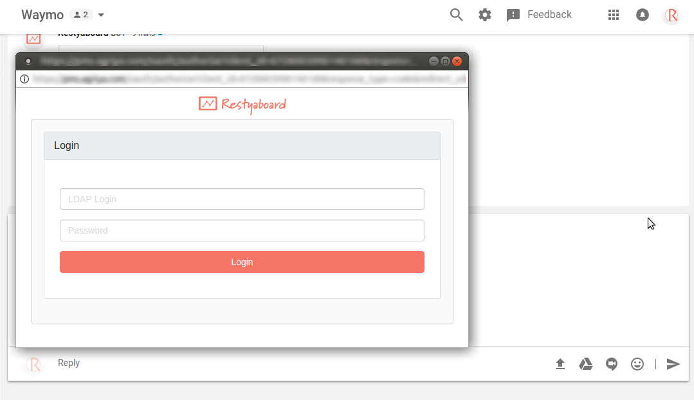

* After Login allow the chat bot to access your Restyaboard account.

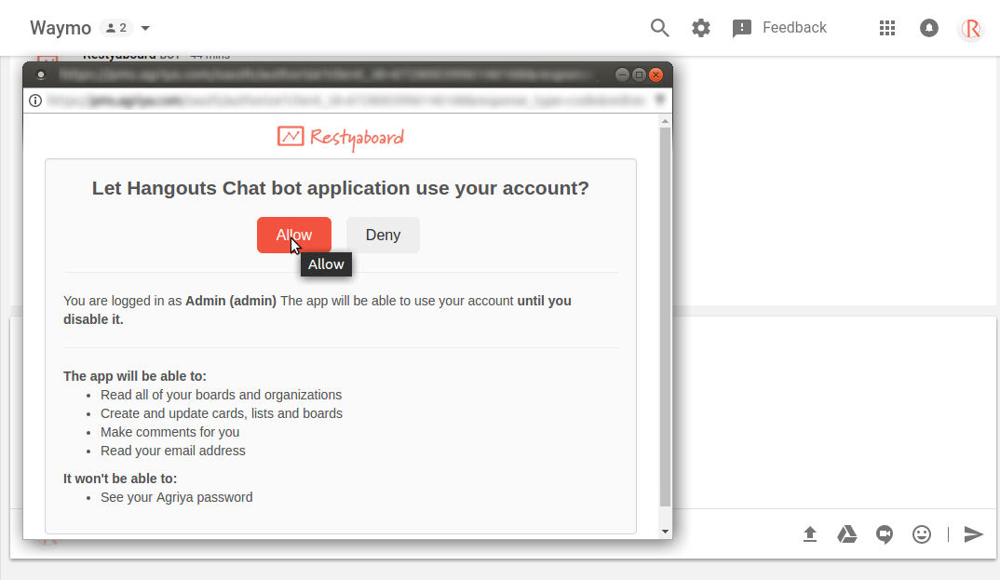

* Now, you can create the card by interacting with chat bot by typing as '@Restyaboard board {board_id}' and then the chat bot will reply as 'Now, you can create you card in board name'.

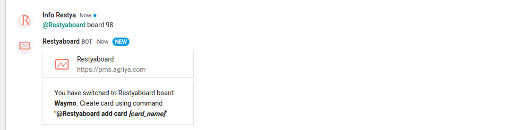

* Now after the bot replied, you can create the card by typing as '@Restyaboard add card {card_name}'.
* After typing above command for adding card, the bot will create the card and reply you with the message, in which list and which board the card was added as response message header as 'card name' and response message body as 'In list list name on board name' and if you are not subscribed to the board, you can subscribe to the card by clicking 'SUBSCRIBE' button and you can add the labels to the card by clicking 'LABELS' button.

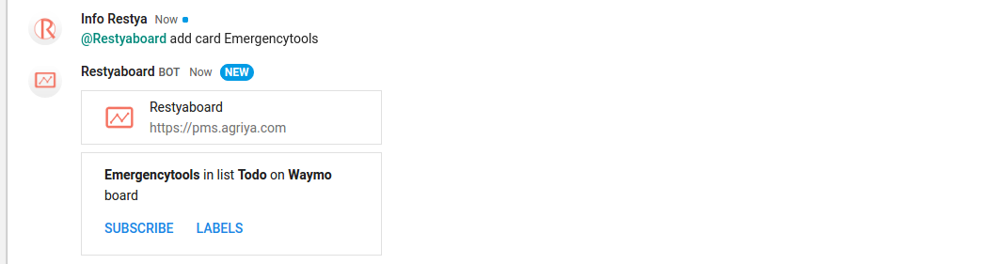

* After clicking 'SUBSCRIBE' button, you will be subscribed to the card and the chat bot will reply as 'The card have been subscribed'.

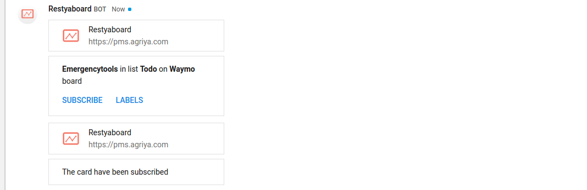

* After clicking 'labels' button, if the board has no labels, then the chat bot will reply as 'Add labels' or if the board has labels, the chat bot will reply with list of labels in the board to select for the card.

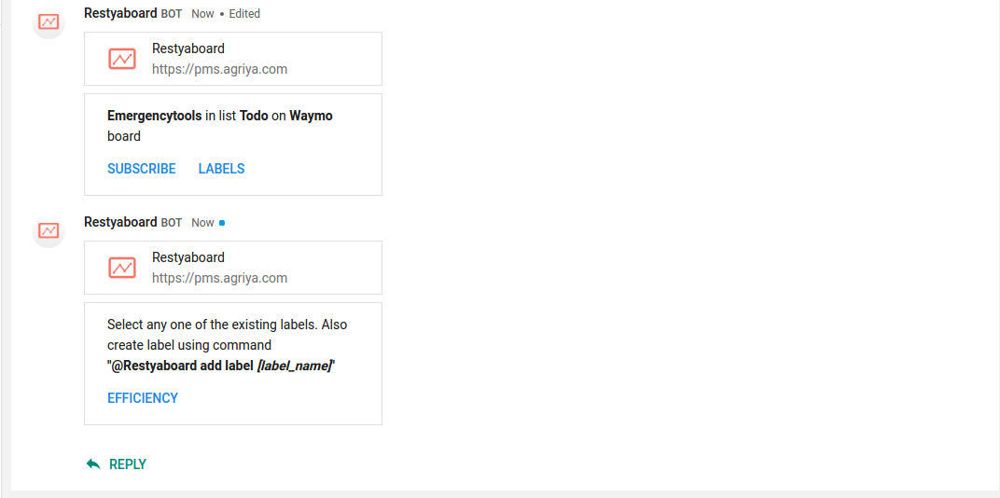

* You can add the labels by typing '@Restyaboard add label {label_name}' and the label will be crated and added to the card and the chat bot will reply as 'Added label to this card {card_name}'.

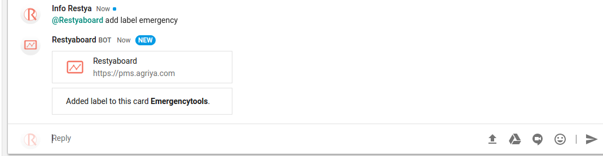

* If the chat bot replied with list of labels to select, then you can add the labels to the card by clicking any particular label and the label will be added to the card and the chat bot will reply as 'Added label to this card {card_name}'.

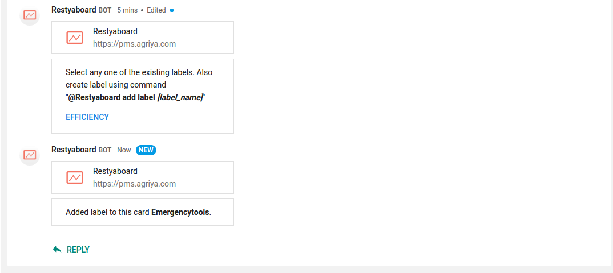  

* If you want to disconnect the account then type as '@Restyaboard logout', this will disconnect your account and reply as 'Your Restyaboard account has been disconnected.' .

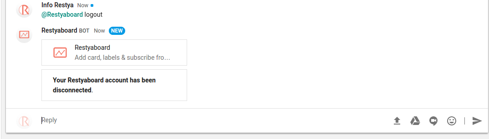  

## What do I Need?

**What do I Need?**
* A convenient assistant that make your life easy by accessing your account from email.
* Help you to never miss a thing from email by creating a card with email subject as title and email body as card description.
* Provide users total and intuitive content over what the user email contains.
* Provides assistance for those who wants to create card ,label and subscribe to card through hangout chat bot.

## My Problems

**My Problems**
* Lack of time due to card,label creation and card subscription during interaction through hangout chat.
* Hard to toggle between the hangout chat interaction and restyaboard account.
* Hard to assign label,subscribe for the cards which have created during the interaction between the chat bot.

## Installation Steps

**Installation Steps**

*   Download [Hangouts Chat bot](https://restya.com/board/apps/r_hangouts_chat_bot).
*   [Contact us](https://restya.com/contact) to get a quote.

## FAQs

**FAQs**

*   Can I post a comment for a card in a board?

The options will be added in the future.