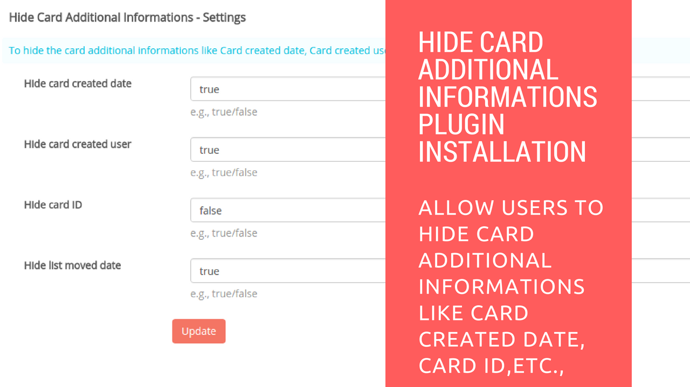

# Hide Card Additiona Informations Plugin Installation

## Hide Card Additiona Informations Plugin Installation

1.  Download the plugin from "https://github.com/RestyaPlatform/board-apps/releases", and choose the latest version and copy the link address "https://github.com/RestyaPlatform/board-apps/releases/download/v1/r_hide_card_additional_informations-v0.1.2.zip"
2.  Goto your Restyaboard installation root directory. e.g., directory: "/usr/share/nginx/html/restyaboard/"
3.  Then goto "client/apps" directory and get the zip file by typing the command "wget {plugin_link}" in the command prompt
4.  Extract/unzip the plugin zip and give file permission to extracted files. e.g., "chmod -R 0777 r_hide_card_additional_informations/"
5.  After above process, clear the browser cache and login again to view the installed plugins on your Restyaboard.