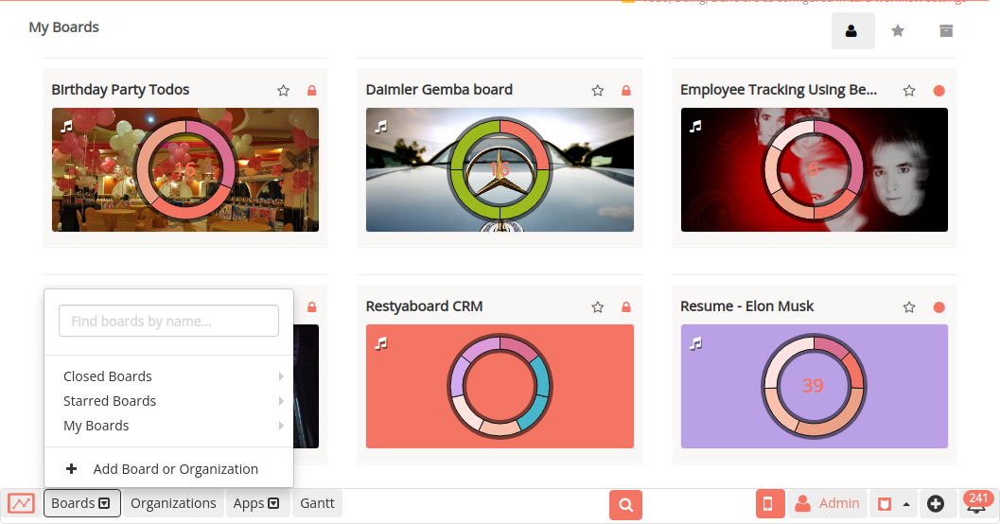
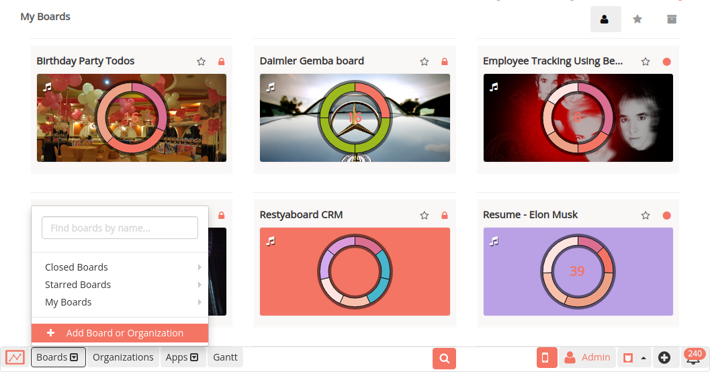
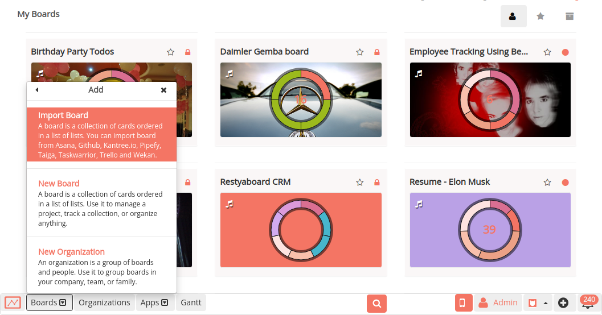
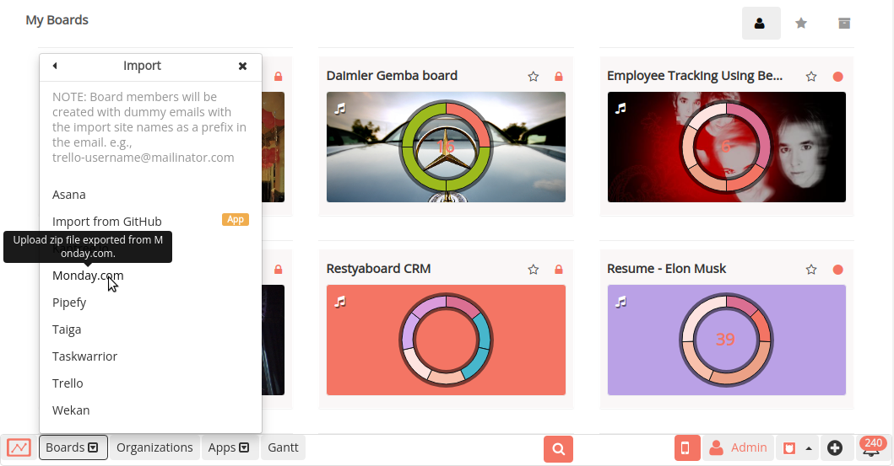

# Import from Monday.com

**Bring any of your work from Monday into Restyaboard!**

## How long does it take to import Monday.com data into Restyaboard? 

It usually takes 2 to 10 minutes to begin the import process. The real importing time can range from 1 minute to several hours after you've imported the Monday.com data. This is solely dependent on the amount of data you have on Monday.com.

## How to import Monday.com data in Restyaboard?

* Click on the Boards option in the footer 

* Click the "Add Board or Organization" option

* Select the “Import Board” option

* Select the “Monday.com” and upload the Monday.com data file

* After uploading the file, the Monday.com data will be imported into the Restyaboard
