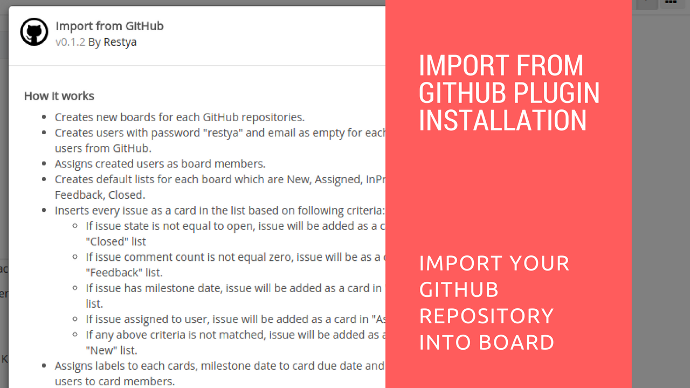

# Import from GitHub Plugin Installation

## Import from GitHub Plugin Installation

1.  Goto your Restyaboard installation root directory. e.g., directory: "/usr/share/nginx/html/restyaboard/"
2.  Extract/unzip the purchased plugin zip into the restyaboard installation path. e.g., "/usr/share/nginx/html/restyaboard/"
3.  Give file permission to extracted files. e.g., "chmod -R 0777 client/apps/r_import_github/"
4.  Goto "client/apps/r_import_github/" directory, to configure the plugin using app.json. Or You can also configure it on "http://{YOUR\_SERVER\_NAME}/#/apps/r_import_github" path in your Restyaboard server.
5.  After above process, clear the browser cache and login again to view the installed plugins on your Restyaboard.