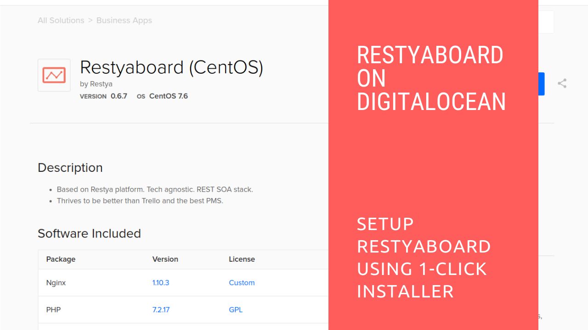
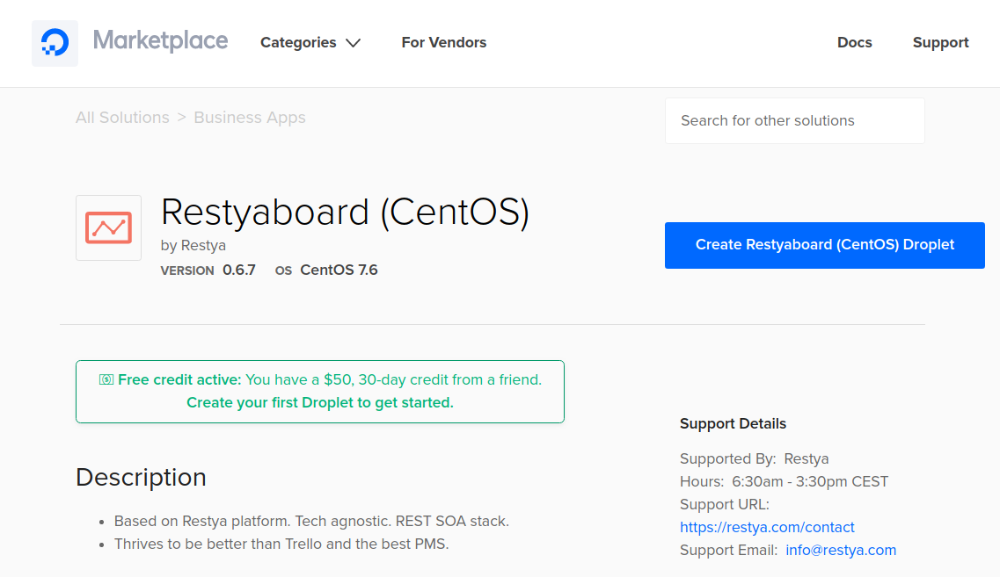
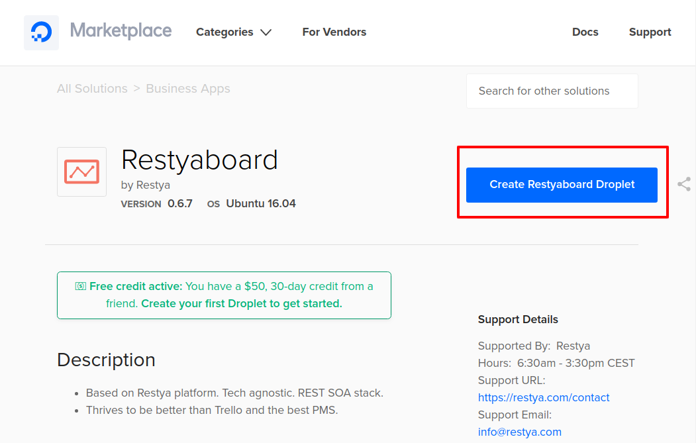
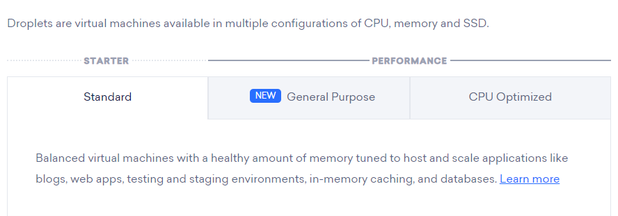
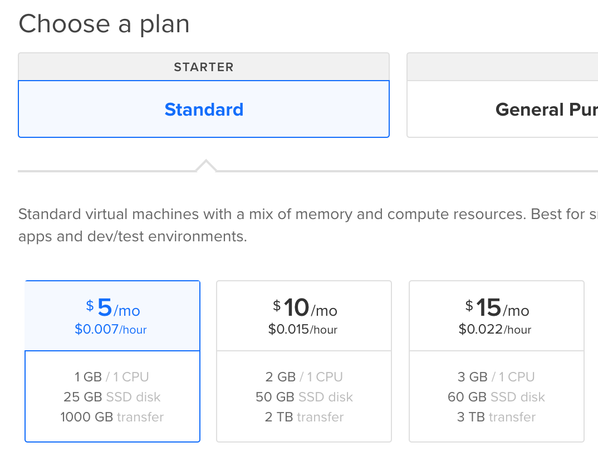
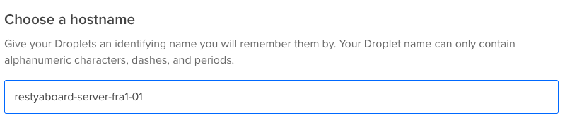

# Install Restyaboard 1-click app through DigitalOcean Marketplace

## Introduction

[Restyaboard](https://restya.com/board) is an open source alternative to Trello, but with smart additional features like offline sync, diff /revisions, nested comments, multiple view layouts, chat, and more. And since it is self-hosted, data, privacy, and IP security can be guaranteed.

Restyaboard is more like an electronic sticky note for organizing tasks and todos. Apart from this, it is ideal for Kanban, Agile, Gemba board and business process/workflow management. It can be extended with [productive plugins](https://restya.com/board/apps "productive plugins")

Today, several universities, automobile companies, government organizations, etc from across Europe take advantage of Restyaboard.

Restyaboard is now available as [1-Click App running in DigitalOcean Droplet\*](https://restya.com/board/digitalocean?v=v0.6.7&s=digitalocean-centos "1-Click App running in DigitalOcean Droplet*")

This document is a step-by-step guide that illustrates how to setup Restyaboard for work with DigitalOcean.

### What you'll learn

*   How to create Restyaboard droplet
*   How to configure Restyaboard droplet
*   How to configure Restyaboard site

## Video Tutorial

For step-by-step instructions on Install Restyaboard 1-click app through DigitalOcean Marketplace, refer [YouTube video](https://www.youtube.com/watch?v=nI4475TgKxA "Watch video on Install Restyaboard 1-click app through DigitalOcean Marketplace")

  

## Creating Restyaboard droplet

Installation instructions
-------------------------

**Step 1: Creating Restyaboard droplet**

1.  If you’re new to DigitalOcean, you can [register a new account](https://restya.com/board/digitalocean?v=v0.6.7&s=digitalocean-centos) to get a $50, 1 month bonus.
    
    
2.  If you are an existing DigitalOcean user – create [Restyaboard droplet with CentOS](https://restya.com/board/digitalocean?v=v0.6.7&s=digitalocean-centos) or create [Restyaboard droplet with Ubuntu](https://restya.com/board/digitalocean?v=v0.6.7&s=digitalocean-ubuntu). Or open DigitalOcean Marketplace and search for Restyaboard (in the “Business” category). 
    
     

## Configuring Restyaboard droplet

**Step 2: Configure Restyaboard droplet properties.**

1.  Configure droplet properties. Start with choosing your Droplet plan (Standard, General Purpose, or CPU Optimized; [learn more about DigitalOcean pricing and available configurations](https://www.digitalocean.com/pricing/).
    
    
    
    Any payment plan in the “Standard” section should be enough to run Restyaboard 1-Click App.
    
    
2.  Choose a hostname, following the instructions. It can only contain alphanumeric characters, dashes, and periods.
    
    A unique name will be automatically generated for you by DigitalOcean – i.e. “restyaboard-server-fra1-01” generated in the screenshot below, you can change it.
    
    

## Configuring Restyaboard site

After creating the Restyaboard droplet, now your Restyaboard site needs to be configured

**Step 3: Configure Restyaboard site.**

1.  Log in with the below-given user credentials
    
    **Username:** admin
    
    **Password:** restya
    
2.  Change your admin password after the successful login.
    
3.  [Configure your Restyaboard](https://restya.com/board/docs/restyaboard-site-configuration/) site by updating business name, email, and 3rd party API keys
4.  If required, setup [additional plugins](https://restya.com/board/apps)
5.  Start managing your tasks by following the below workflows
    
    *   [Restyaboard in Checklist Based Workflow](https://restya.com/board/docs/restyaboard-checklist-based-workflow/)
    *   [Restyaboard in Label Based Workflow](https://restya.com/board/docs/restyaboard-label-based-workflow/)
    *   [Restyaboard in List Based Workflow](https://restya.com/board/docs/restyaboard-list-based-workflow/)