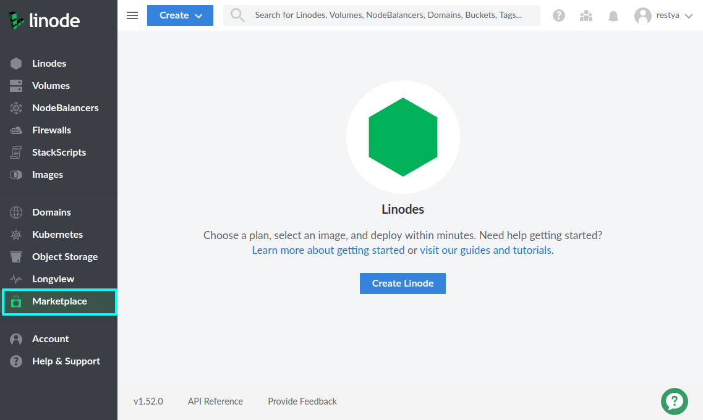
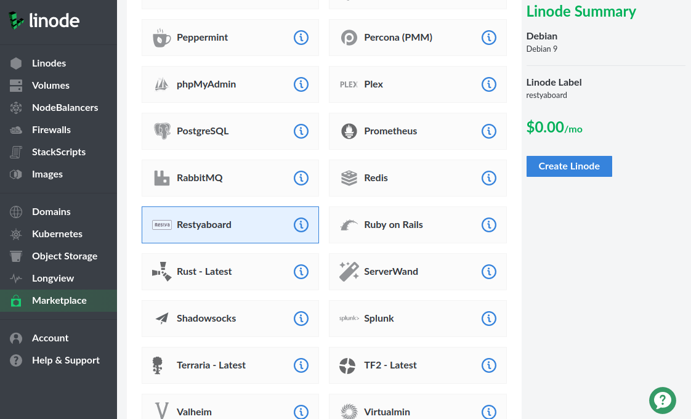
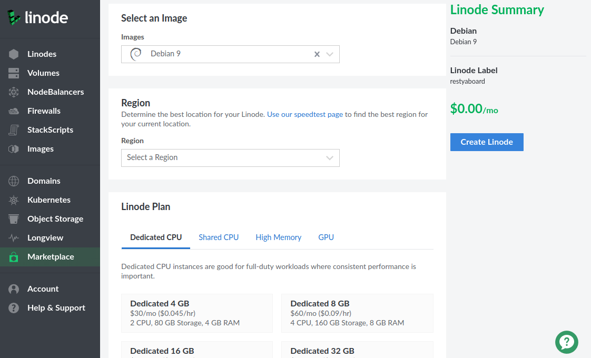
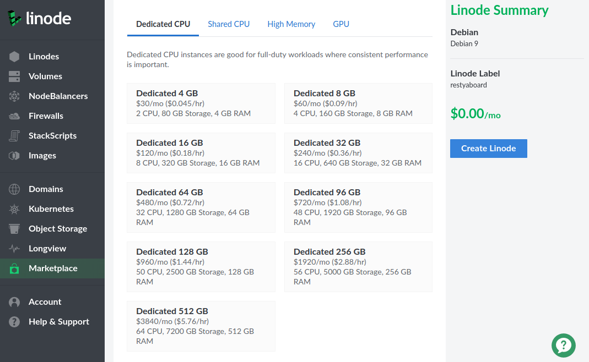
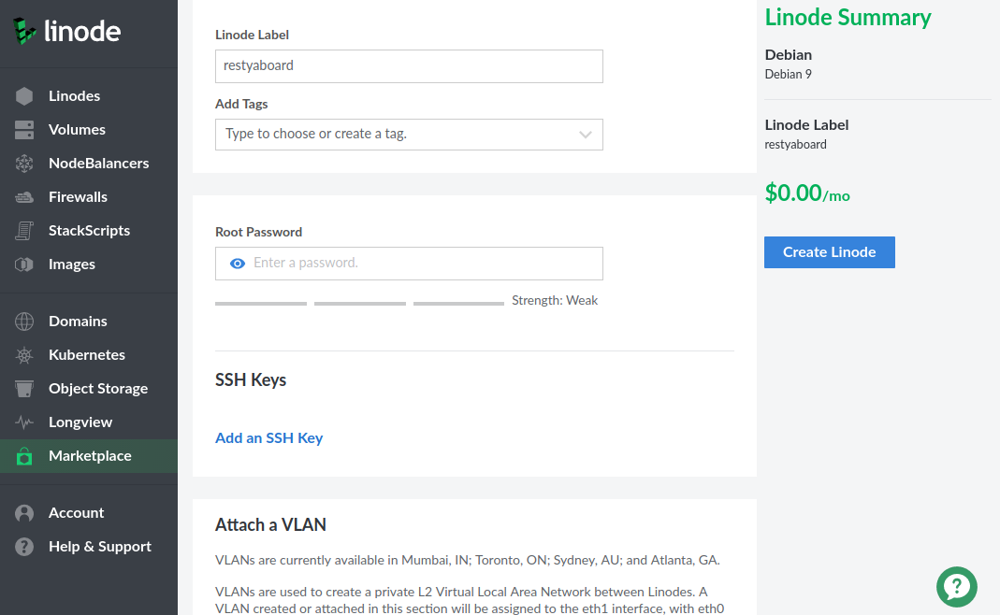
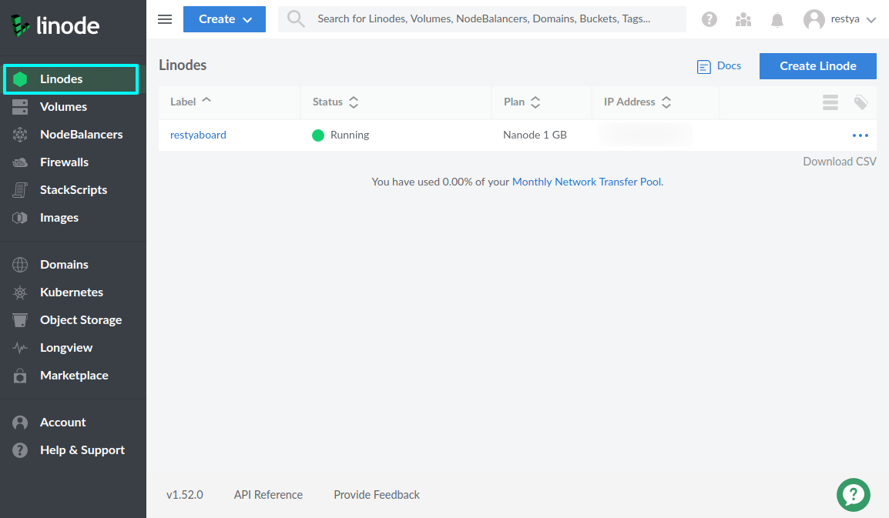
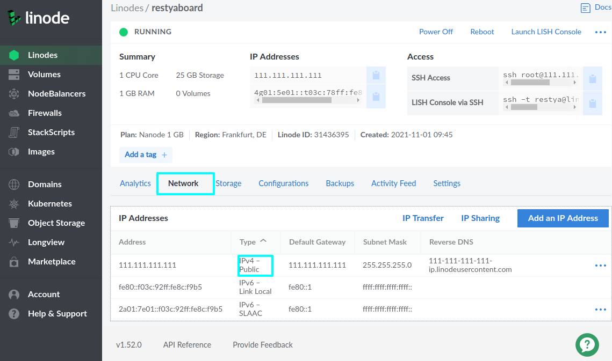

# Install Restyaboard 1-click app through Linode Marketplace

## Introduction

[Restyaboard](https://restya.com/board) is an open-source alternative to Trello, but with smart additional features like offline sync, diff /revisions, nested comments, multiple view layouts, chat, and more. And since it is self-hosted, data, privacy, and IP security can be guaranteed.

Restyaboard is more like an electronic sticky note for organizing tasks and todos. Apart from this, it is ideal for Kanban, Agile, Gemba board and business process/workflow management. It can be extended with [productive plugins](https://restya.com/board/apps "productive plugins")

Today, several universities, automobile companies, government organizations, etc from across Europe take advantage of Restyaboard.

## Deploy a Restyaboard Marketplace App

Linode’s App Marketplace allows you to easily deploy Restyaboard software on a Linode using the Linode Cloud Manager. To access Linode’s App Marketplace:

1. Log in to your [Linode Cloud Manager](https://cloud.linode.com/ "Linode Cloud Manager") account.
2. From the Linode dashboard, click on the **Marketplace** button in the left-hand navigation menu.

     

3. The Linode creation page appears, with the **Marketplace** tab pre-selected.
4. Under the **Select App** section, select the **Restyaboard** app to deploy

     

5. Once you have selected the app, proceed to the app’s Options section and provide values for the required fields.
6. The Image section displays that Debian is pre-selected. This is the underlying operating system that your Linode will run.

     

7. Under the Region section, choose which data center you would like your app to be deployed to.
8. Choose which plan you’d like to use under the Linode Plan section. Your plan specifies the hardware resources assigned to your server. The resources that you need are determined by the requirements of your app. Linode’s plans are split into four types: Shared, Dedicated CPU, High Memory, and GPU.

    

9. Create a label and (optionally) select tags for your Linode. The label is your Linode’s name and must be unique among all the Linodes on your account. [Tags](https://www.linode.com/docs/quick-answers/linode-platform/tags-and-groups/) are used to organize your Linodes within the Cloud Manager.

    

10. Create a root password. You will need it if you ever decide to perform maintenance on your server in the future.
11. Click Create. You will be taken to the Linode’s Dashboard where you can monitor the status of your Linode’s creation.

    

12. Once your Linode has been created, the Cloud Manager will then start to deploy your app in the background. This will take several minutes. Once your app has been deployed it will be available at the IP address of the Linode you created. If you visit your IP address before the app is ready, try again a few minutes later.

## Getting Started After Deployment

### Configuring Restyaboard site

After Restyaboard has finished installing, you can access your Restyaboard site by copying your Linode’s IPv4 address and entering it in the browser of your choice. To find your Linode’s IPv4 address:

1. Click on the **Linodes** link in the sidebar to see a list of all your Linodes.

    

2. Find the Linode you just created when deploying your app and select it.
3. Navigate to the **Networking** tab.

    

4. Your IPv4 address is listed under the **Address** column in the **IPv4** table.
5. Copy and paste the IPv4 address into a browser window. You should see your Restyaboard site’s login page.
6. Log in with the below-given user credentials
    
    **Username:** admin
    
    **Password:** restya

7. Please change your admin password after successful login.
8.  [Configure your Restyaboard](https://restya.com/board/docs/restyaboard-site-configuration/) site by updating business name, email, and 3rd party API keys
9.  If required, setup [additional plugins](https://restya.com/board/apps)
10.  Start managing your tasks by following the below workflows
    
    *   [Restyaboard in Checklist Based Workflow](https://restya.com/board/docs/restyaboard-checklist-based-workflow/)
    *   [Restyaboard in Label Based Workflow](https://restya.com/board/docs/restyaboard-label-based-workflow/)
    *   [Restyaboard in List Based Workflow](https://restya.com/board/docs/restyaboard-list-based-workflow/)