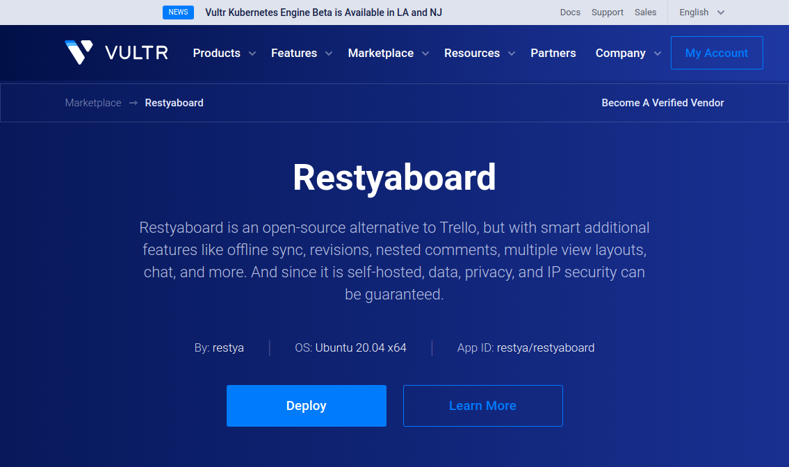
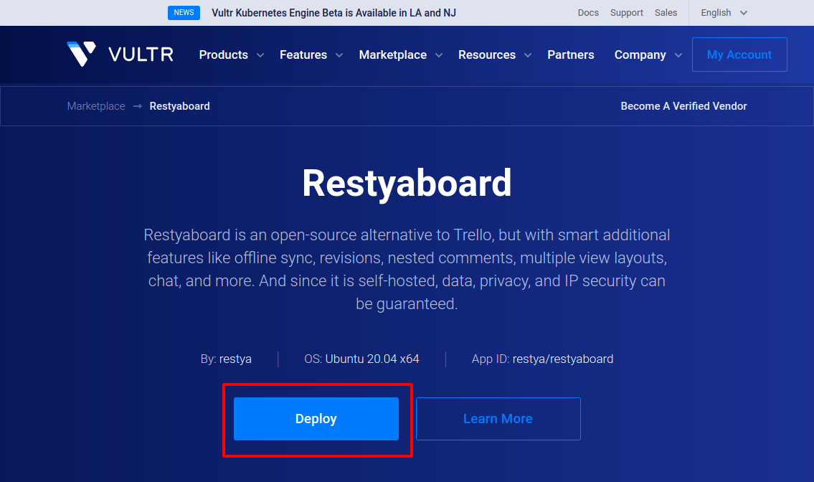
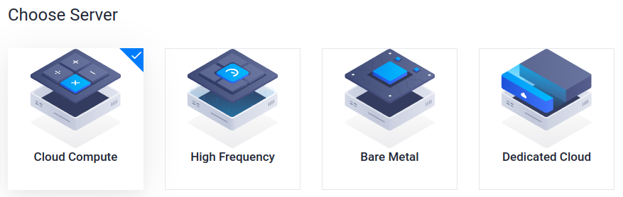
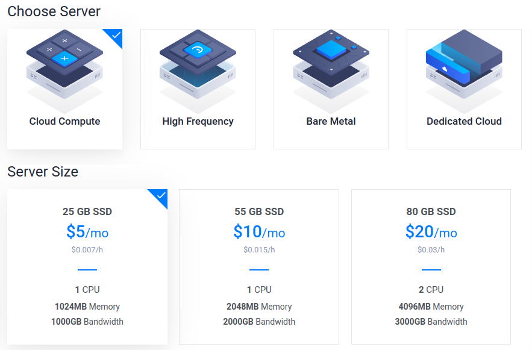
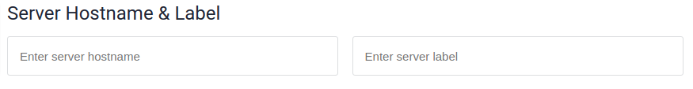

# Install Restyaboard 1-click app through Vultr Marketplace

## Introduction

[Restyaboard](https://restya.com/board) is an open source alternative to Trello, but with smart additional features like offline sync, diff /revisions, nested comments, multiple view layouts, chat, and more. And since it is self-hosted, data, privacy, and IP security can be guaranteed.

Restyaboard is more like an electronic sticky note for organizing tasks and todos. Apart from this, it is ideal for Kanban, Agile, Gemba board and business process/workflow management. It can be extended with [productive plugins](https://restya.com/board/apps "productive plugins")

Today, several universities, automobile companies, government organizations, etc from across Europe take advantage of Restyaboard.

Restyaboard is now available as [1-Click App running in Vultr Marketplace\*](https://restya.com/board/vultr?v=v1.7&s=ubuntu "1-Click App running in Vultr Marketplace*")

This document is a step-by-step guide that illustrates how to setup Restyaboard for work with Vultr.

### What you'll learn

*   How to create Restyaboard VPS
*   How to configure Restyaboard VPS
*   How to configure Restyaboard site

## Creating Restyaboard VPS

Installation instructions
-------------------------

**Step 1: Creating Restyaboard VPS**

1.  If you’re new to Vultr, you can [register a new account](https://restya.com/board/vultr?v=v1.7&s=new-vultr-customer) to get a $100.
    
    
2.  If you are an existing Vultr user – create [Restyaboard VPS with Ubuntu](https://restya.com/board/vultr?v=v1.7&s=ubuntu). Or open Vultr Marketplace and search for Restyaboard (in the “Business” category). 
    
     

## Configuring Restyaboard VPS

**Step 2: Configure Restyaboard VPS properties.**

1.  Configure VPS properties. Start with choosing your VPS Server (Cloud Compute, High Frequency, Bare Metal, or Dedicated Cloud; [learn more about VPS pricing and available configurations](https://www.vultr.com/products/cloud-compute/#pricing).
    
    
    
    Any payment plan in the “Standard” section should be enough to run Restyaboard 1-Click App.
    
    
2.  Choose a hostname, following the instructions. It can only contain alphanumeric characters, dashes, and periods.
    
    

## Configuring Restyaboard site

After creating the Restyaboard VPS, now your Restyaboard site needs to be configured

**Step 3: Configure Restyaboard site.**

1.  Log in with the below-given user credentials
    
    **Username:** admin
    
    **Password:** restya
    
2.  Change your admin password after the successful login.
    
3.  [Configure your Restyaboard](https://restya.com/board/docs/restyaboard-site-configuration/) site by updating business name, email, and 3rd party API keys
4.  If required, setup [additional plugins](https://restya.com/board/apps)
5.  Start managing your tasks by following the below workflows
    
    *   [Restyaboard in Checklist Based Workflow](https://restya.com/board/docs/restyaboard-checklist-based-workflow/)
    *   [Restyaboard in Label Based Workflow](https://restya.com/board/docs/restyaboard-label-based-workflow/)
    *   [Restyaboard in List Based Workflow](https://restya.com/board/docs/restyaboard-list-based-workflow/)