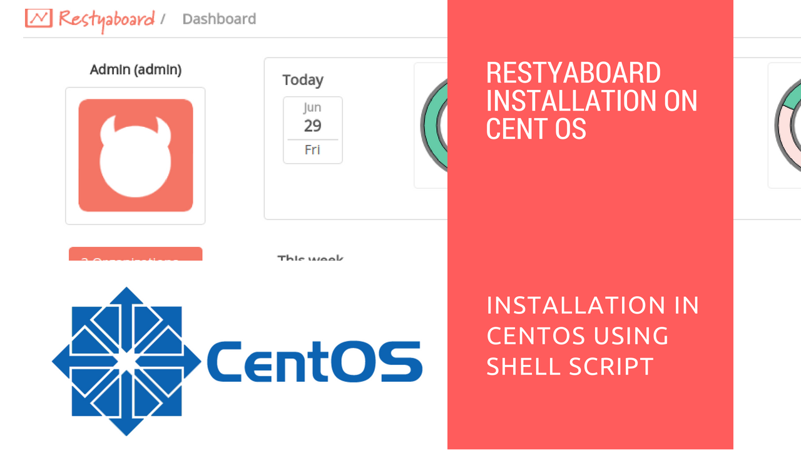

# Installation in CentOS using shell script

## Introduction

[Restyaboard](https://restya.com/board) is an open source alternative to Trello, but with smart additional features like offline sync, diff /revisions, nested comments, multiple view layouts, chat, and more. And since it is self-hosted, data, privacy, and IP security can be guaranteed.

Restyaboard is more like an electronic sticky note for organizing tasks and todos. Apart from this, it is ideal for Kanban, Agile, Gemba board and business process/workflow management. It can be extended with [productive plugins](https://restya.com/board/apps "productive plugins")

Today, several universities, automobile companies, government organizations, etc from across Europe take advantage of Restyaboard.

This document contains information about how to install Restyaboard in CentOS using shell script.

### What you'll learn

*   How to install the Restyaboard in CentOS using shell script

## Video Tutorial

For step-by-step instructions on Installation in CentOS using shell script, refer [YouTube video](https://www.youtube.com/watch?v=hcnIHZnS1o8 "Watch video on Installation in CentOS using shell script")

## Installation in CentOS using shell script

1.  Install script will automatically install required software, you can get the raw code from `https://raw.githubusercontent.com/RestyaPlatform/board/master/restyaboard.sh` and save it as a shell script file. eg.,`restyaboard.sh`
2.  You may use wget to download install script: `wget https://github.com/RestyaPlatform/board/raw/master/restyaboard.sh –no-check-certificate`
3.  In restyaboard.sh, `update PostgreSQL configurations` as you wanted. For intranet or medium security setup, you may leave it as it is. If you edit, you must remember the details
4.  Execute `chmod +x restyaboard.sh` command
5.  Execute restyaboard.sh by using `./restyaboard.sh` command
6.  After complete installation of Restyaboard using shell script, please enter your `Restyaboard URL` in the browser, If the Restyaboard page is empty, we think disable selinux and reboot the machine may resolve your problem. For disabling selinux, please refer this video [https://www.youtube.com/watch?v=hcnIHZnS1o8?t=150](https://www.youtube.com/watch?v=hcnIHZnS1o8?t=150 "Selinux Disablie").