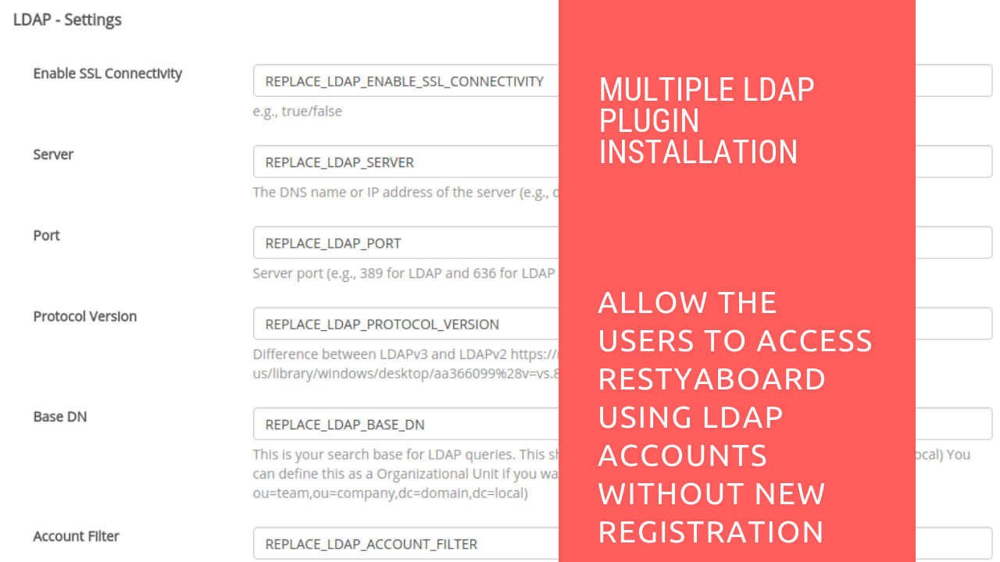

# Multiple LDAP Plugin Installation

## Introduction

[Restyaboard](https://restya.com/board) is an open source alternative to Trello, but with smart additional features like offline sync, diff /revisions, nested comments, multiple view layouts, chat, and more. And since it is self-hosted, data, privacy, and IP security can be guaranteed.

Restyaboard is more like an electronic sticky note for organizing tasks and todos. Apart from this, it is ideal for Kanban, Agile, Gemba board and business process/workflow management. It can be extended with [productive plugins](https://restya.com/board/apps "productive plugins")

Today, several universities, automobile companies, government organizations, etc from across Europe take advantage of Restyaboard.

This document contains information about how to install Multiple LDAP app in Restyaboard.

### What you'll learn

*   How to install Multiple LDAP app in Restyaboard

## Video Tutorial

For step-by-step instructions on installation and usage of Multiple LDAP Plugin Installation in Restyaboard, refer [YouTube video](https://www.youtube.com/watch?v=KQ6GbYPZC8U "Watch video on Multiple LDAP Plugin Installation in Restyaboard")

## Multiple LDAP Plugin Installation

1.  Download [Multiple LDAP App](https://restya.com/board/apps/r_multiple_ldap_login "Multiple LDAP App")
2.  Goto your Restyaboard installation root directory. e.g., directory: `/usr/share/nginx/html/restyaboard/`
3.  Unzip the purchased Multiple LDAP app into your root directory
4.  Open a command prompt in the `/usr/share/nginx/html/restyaboard/client/apps/r_multiple_ldap_login/` path and give the executable permission to the shell file `multiple_ldap_login.sh`.e.g., `chmod +x multiple_ldap_login.sh`
5.  Run the shell script file. e.g., `./multiple_ldap_login.sh`
6.  Configure Multiple LDAP on `http://{YOUR_SERVER_NAME}/#/apps/r_multiple_ldap_login` path in your Restyaboard server.
7.  Finally, clear the browser cache, login with LDAP login credentials to login.

