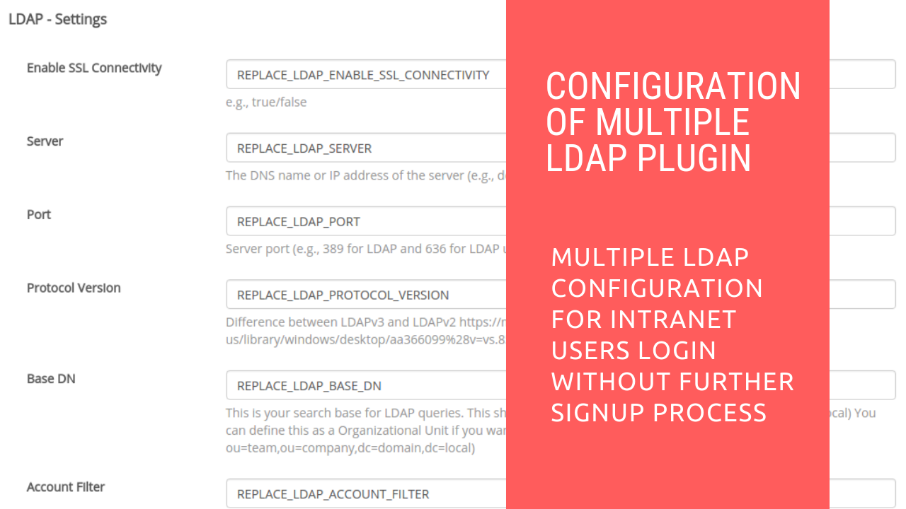

# Multiple LDAP

## Introduction

[Restyaboard](https://restya.com/board) is an open source alternative to Trello, but with smart additional features like offline sync, diff /revisions, nested comments, multiple view layouts, chat, and more. And since it is self-hosted, data, privacy, and IP security can be guaranteed.

Restyaboard is more like an electronic sticky note for organizing tasks and todos. Apart from this, it is ideal for Kanban, Agile, Gemba board and business process/workflow management. It can be extended with [productive plugins](https://restya.com/board/apps "productive plugins")

Today, several universities, automobile companies, government organizations, etc from across Europe take advantage of Restyaboard.

This document contains information about how to enable Multiple LDAP and its connectivity setup in Restyaboard.

### What you'll learn

*   How to enable Multiple LDAP and its connectivity setup in Restyaboard

## Video Tutorial

For step-by-step instructions on configuration of Multiple LDAP server in Restyaboard, refer [YouTube video](https://www.youtube.com/watch?v=7FYwr1WdNzc "Watch video on Configuration of Multiple LDAP Plugin")

## Server Details

**Server**

*   The DNS name or IP address of the server (e.g., dc.domain.local)

**Port**

*   Server port (e.g., 389 for Multiple LDAP and 636 for Multiple LDAP using SSL)

**Protocol Version**

*   3 (Difference betwen LDAPv3 and LDAPv2 https://msdn.microsoft.com/en-us/library/windows/desktop/aa366099%28v=vs.85%29.aspx)

**Base DN**

*   This is your search base for Multiple LDAP queries.
*   This should be at least your domain root, (e.g., dc=domain,dc=local) You can define this as an Organizational Unit if you want to narrow down the search base (e.g., ou=team,ou=company,dc=domain,dc=local)

## Connection details

**Account Filter**

*   You can use different field from the username here. For pre-windows 2000 style login, use sAMAccountName and for a UPN style login use userPrincipalName.

**Advanced Filter**

*   Enter a valid advanced filter like “(objectClass=user)(memberOf=CN=foo,OU=groups,dc=bar,dc=baz)”, to filter user, groups and etc…

**Bind DN**

*   Enter a valid user account/DN to pre-bind with if your Multiple LDAP server does not allow anonymous profile searches, or requires a user with specific privileges to search

**Bind Password**

*   Enter a password for the above Bind DN.