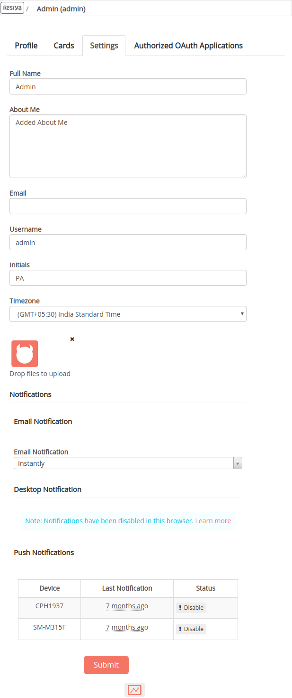
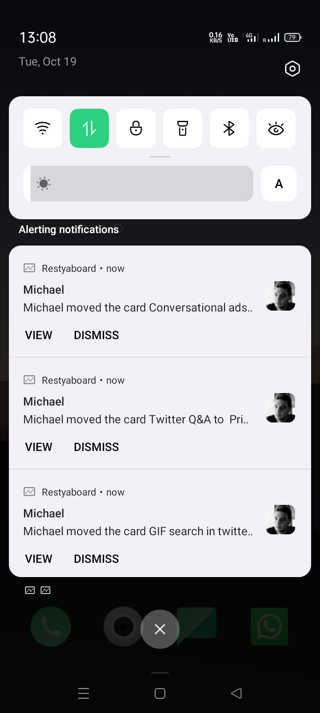

# Push Notifications

Depending on the notification functions and goals, push notifications are often displayed as a full screen or as a top or bottom banner.

Unlike SMS, which is used for conversational communication, push notifications are a type of marketing automation that is used to provide critical information in a unique and customized way to app users.

## Manage Push Notifications

For the Restyaboard mobile app, you can enable and disable the push notifications on the user’s profile settings page.

Restyaboard app is available on both Android and iOS. Regular mobile apps are common for all instances. You'll need to enter an instance URL to get started(For more details, refer to our website ). Being a common app for multiple Restyaboard instances, push notifications are routed through our common proxy. Hence, you'll need to whitelist your server IP with us. Though we don't intercept push messages, if you're worried about data privacy, please contact us for a customized mobile app offering.

For the other user activities, the user will receive the push notification in the Android mobile app.

