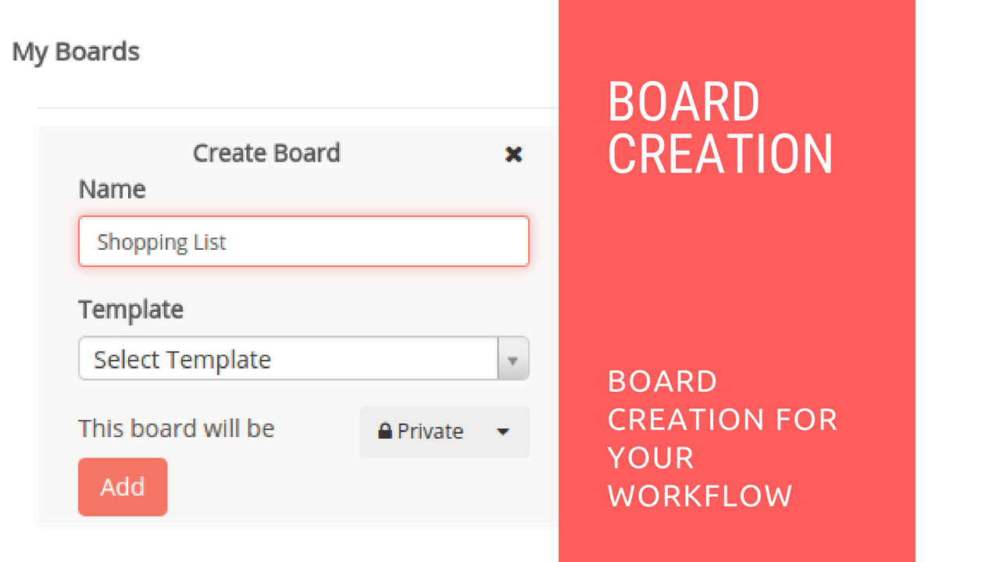

# Board Creaion in Restyaboard

## Introduction

[Restyaboard](https://restya.com/board) is an open source alternative to Trello, but with smart additional features like offline sync, diff /revisions, nested comments, multiple view layouts, chat, and more. And since it is self-hosted, data, privacy, and IP security can be guaranteed.

Restyaboard is more like an electronic sticky note for organizing tasks and todos. Apart from this, it is ideal for Kanban, Agile, Gemba board and business process/workflow management. It can be extended with [productive plugins](https://restya.com/board/apps "productive plugins")

Today, several universities, automobile companies, government organizations, etc from across Europe take advantage of Restyaboard.

This document contains information about how to create a board in Restyaboard.

### What you'll learn

*   How to Create a Board in Restyaboard

## Video Tutorial

For step-by-step instructions on Board Creation in Restyaboard, refer [YouTube video](https://www.youtube.com/watch?v=AQzQeZvq4a8 "Watch video on Board Creation in Restyaboard")

## Board Creaion in Restyaboard

1.  After login, you can create the board if you have permissions.
2.  You can create a board with different templates.
3.  After creating the board, you can change the `Board Visibility` and you can also add members to the board.
4.  You can also add the `Star` to the board, if you have the permission.
5.  You can also see the closed boards, starred boards and My Boards if you have the permission.
