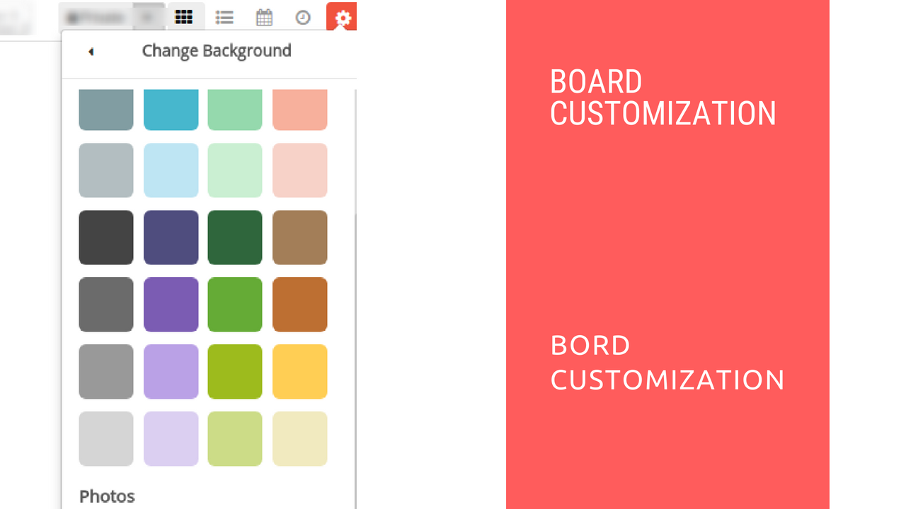

# Board Customization in Restyaboard

## Introduction

[Restyaboard](https://restya.com/board) is an open source alternative to Trello, but with smart additional features like offline sync, diff /revisions, nested comments, multiple view layouts, chat, and more. And since it is self-hosted, data, privacy, and IP security can be guaranteed.

Restyaboard is more like an electronic sticky note for organizing tasks and todos. Apart from this, it is ideal for Kanban, Agile, Gemba board and business process/workflow management. It can be extended with [productive plugins](https://restya.com/board/apps "productive plugins")

Today, several universities, automobile companies, government organizations, etc from across Europe take advantage of Restyaboard.

This document contains information about how to customize a board in Restyaboard.

### What you'll learn

*   How to Customize a Board in Restyaboard

## Video Tutorial

For step-by-step instructions on Board Customization in Restyaboard, refer [YouTube video](https://www.youtube.com/watch?v=uzf0V7CPRfY "Watch video on Board Customization in Restyaboard")

## Board Customization in Restyaboard

1.  Please go to any board page.
2.  Please click `Settings Icon` in the Board Header for opening the Board actions and you can customize the board using the list of options.
3.  You can change the Background with colors, patterns and Images and You can add the music to the board.