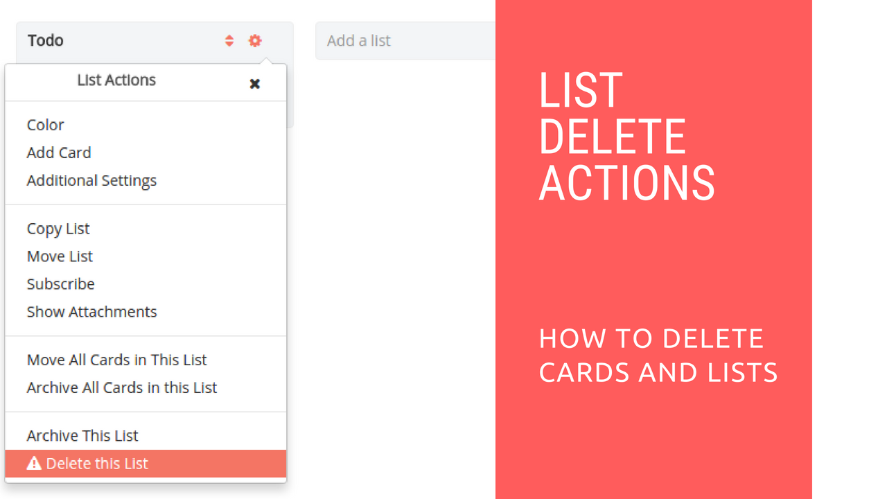

# Restyaboard Card and List Delete Actions

## Introduction

[Restyaboard](https://restya.com/board) is an open source alternative to Trello, but with smart additional features like offline sync, diff /revisions, nested comments, multiple view layouts, chat, and more. And since it is self-hosted, data, privacy, and IP security can be guaranteed.

Restyaboard is more like an electronic sticky note for organizing tasks and todos. Apart from this, it is ideal for Kanban, Agile, Gemba board and business process/workflow management. It can be extended with [productive plugins](https://restya.com/board/apps "productive plugins")

Today, several universities, automobile companies, government organizations, etc from across Europe take advantage of Restyaboard.

This document contains information about how to delete card and list in Restyaboard.

### What you'll learn

*   How to Delete Card and List in Restyaboard?

## Video Tutorial

For step-by-step instructions on Restyaboard Card and List Delete Actions, refer [YouTube video](https://www.youtube.com/watch?v=FZLyfPM2wYQ "Watch video on Restyaboard Card and List Delete Actions")

## Restyaboard Card and List Delete Actions

1.  After login, please goto any board page.
2.  You can delete the card and list if you have the permissions.
3.  For list delete action, please click the `Settings Icon` in the list header
4.  Then click `Delete this list` option and confirm it by clicking the `Delete` button.
5.  For card delete action, first you have to archive the card by clicking `Archive` option and the card will be archived.
6.  You can delete the archived card by opening the `Board Header` settings menu and click `Archived Items` and you can delete the card by clicking `Close` button.
  