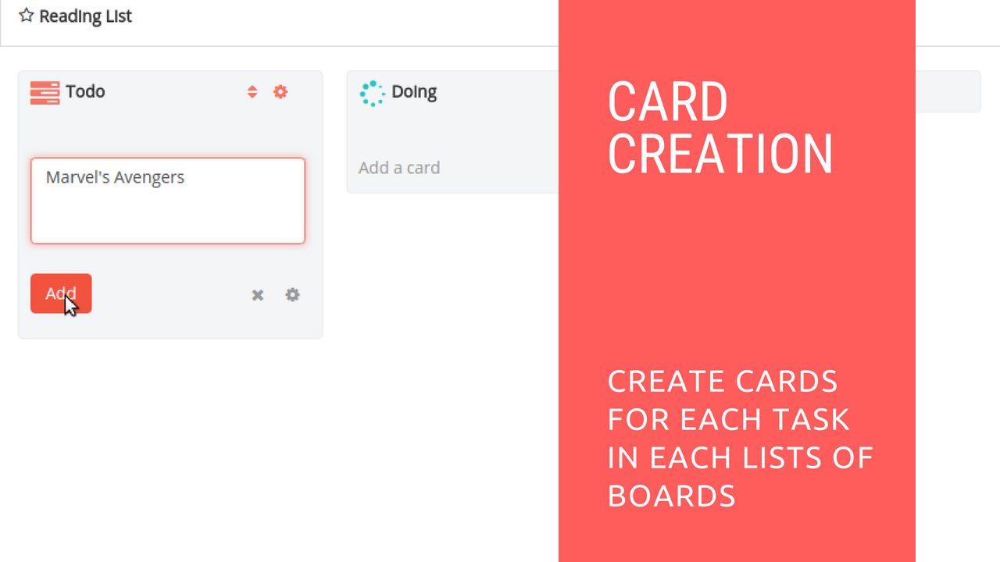

# Card Creaion in Restyaboard

## Introduction

[Restyaboard](https://restya.com/board) is an open source alternative to Trello, but with smart additional features like offline sync, diff /revisions, nested comments, multiple view layouts, chat, and more. And since it is self-hosted, data, privacy, and IP security can be guaranteed.

Restyaboard is more like an electronic sticky note for organizing tasks and todos. Apart from this, it is ideal for Kanban, Agile, Gemba board and business process/workflow management. It can be extended with [productive plugins](https://restya.com/board/apps "productive plugins")

Today, several universities, automobile companies, government organizations, etc from across Europe take advantage of Restyaboard.

This document contains information about how to create a card in Restyaboard.

### What you'll learn

*   How to Create a Card in Restyaboard?

## Video Tutorial

For step-by-step instructions on Card Creation in Restyaboard, refer [YouTube video](https://www.youtube.com/watch?v=IXcBPDuZz_0 "Watch video on Card Creation in Restyaboard")

## Card Creaion in Restyaboard

1.  After login, goto any board page.
2.  You can create the card in any lists of the board page.
3.  You can also create the card with `Template` option, if the `Card Template` plugin is enabled.
4.  You can also create the card without entering the board with `Instant add card` plugin, using instant add card, you can add an attachment, add member and add start date if you have permissions.
