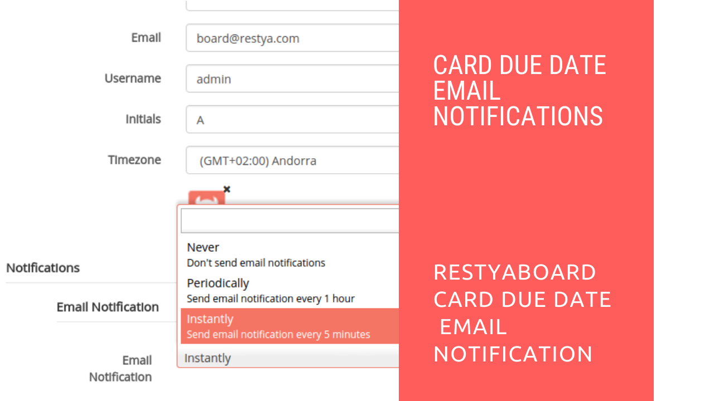

# Restyaboard Card Due Date Email Notification

## Introduction

[Restyaboard](https://restya.com/board) is an open source alternative to Trello, but with smart additional features like offline sync, diff /revisions, nested comments, multiple view layouts, chat, and more. And since it is self-hosted, data, privacy, and IP security can be guaranteed.

Restyaboard is more like an electronic sticky note for organizing tasks and todos. Apart from this, it is ideal for Kanban, Agile, Gemba board and business process/workflow management. It can be extended with [productive plugins](https://restya.com/board/apps "productive plugins")

Today, several universities, automobile companies, government organizations, etc from across Europe take advantage of Restyaboard.

This document contains information about how to recieve card due date mail notification in Restyaboard.

### What you'll learn

*   How to Receive Card Due Date Mail Notification in Restyaboard

## Video Tutorial

For step-by-step instructions on Restyaboard Card Due Date Email Notification, refer [YouTube video](https://www.youtube.com/watch?v=L5C1o-Gvee0 "Watch video on Restyaboard Card Due Date Email Notification")

## Restyaboard Card Due Date Email Notification

1.  Goto your Restyaboard login page and sign in with user credentials.
2.  After login, go to the particular board by clicking the board.
3.  In the board page, please open the card from which you want to receive the `Due Date mail notification`.
4.  In the card page, please check if you are assigned to the card to receive the Due Date mail notification.