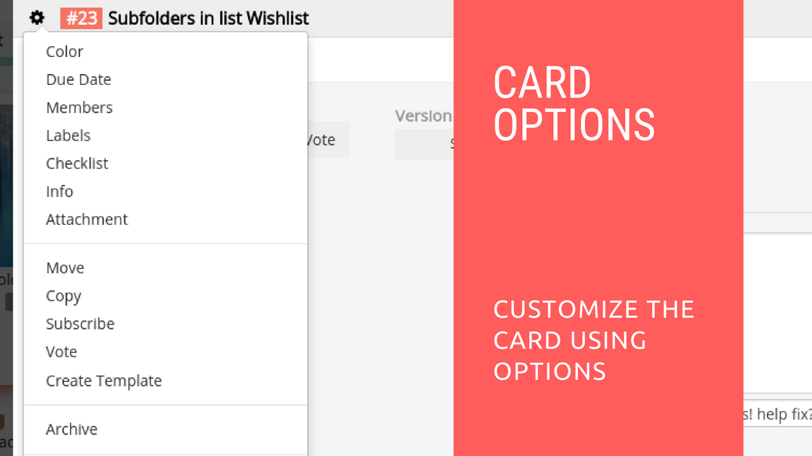

# Restyaboard Card Options

## Introduction

[Restyaboard](https://restya.com/board) is an open source alternative to Trello, but with smart additional features like offline sync, diff /revisions, nested comments, multiple view layouts, chat, and more. And since it is self-hosted, data, privacy, and IP security can be guaranteed.

Restyaboard is more like an electronic sticky note for organizing tasks and todos. Apart from this, it is ideal for Kanban, Agile, Gemba board and business process/workflow management. It can be extended with [productive plugins](https://restya.com/board/apps "productive plugins")

Today, several universities, automobile companies, government organizations, etc from across Europe take advantage of Restyaboard.

This document contains information about how to customize a card in Restyaboard.

### What you'll learn

*   How to Customize a Card in Restyaboard?

## Video Tutorial

For step-by-step instructions on Restyaboard Card Options, refer [YouTube video](https://www.youtube.com/watch?v=P0YqT8dfa38 "Watch video on Restyaboard Card Options")

## Restyaboard Card Options

1.  After login, please goto any board page.
2.  Click any one of the cards in the list by clicking.
3.  After opening the card, you can add the members, add labels, add start date, add color and add custom fields if you have the permission.
4.  You can also copy the card (or) move the card (or) archive the card, if you have the permission.