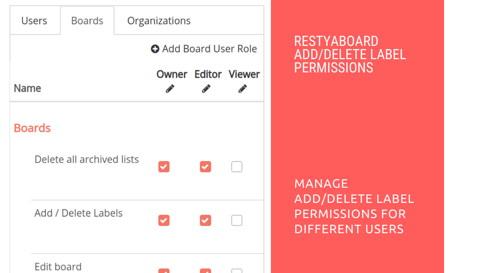

# Check Permission for Add/Edit Labels

## Introduction

[Restyaboard](https://restya.com/board) is an open source alternative to Trello, but with smart additional features like offline sync, diff /revisions, nested comments, multiple view layouts, chat, and more. And since it is self-hosted, data, privacy, and IP security can be guaranteed.

Restyaboard is more like an electronic sticky note for organizing tasks and todos. Apart from this, it is ideal for Kanban, Agile, Gemba board and business process/workflow management. It can be extended with [productive plugins](https://restya.com/board/apps "productive plugins")

Today, several universities, automobile companies, government organizations, etc from across Europe take advantage of Restyaboard.

This document contains information about how to check permission for add/edit labels on Restyaboard.

### What you'll learn

*   How to check permission for add/edit labels on Restyaboard?

## Video Tutorial

For step-by-step instructions on How to check permission for add/edit labels on Restyaboard?, refer [YouTube video](https://www.youtube.com/watch?v=PvDJ1qR3O2g "Watch video on check permission for add/edit labels")

## Check Permission for Add/Edit Labels

1.  Goto your Restyaboard login page and sign in with admin credentials.
2.  After login, go to the admin panel by clicking the admin button in the footer.
3.  In the admin panel, click the `Roles` link in the heading to go to the roles page and click the `Boards` tab to check the `Add or Delete labels` permission for board user roles.
4.  Under the `Boards` tab, check if the permission named `Add or Delete Labels` has been enabled for the board user roles.