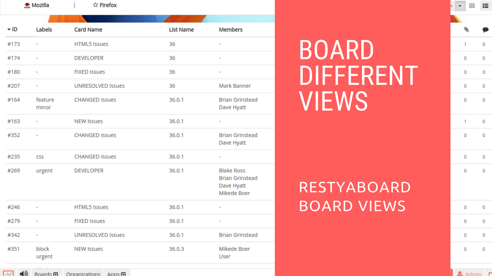

# Restyaboard Different Board Views

## Introduction

[Restyaboard](https://restya.com/board) is an open source alternative to Trello, but with smart additional features like offline sync, diff /revisions, nested comments, multiple view layouts, chat, and more. And since it is self-hosted, data, privacy, and IP security can be guaranteed.

Restyaboard is more like an electronic sticky note for organizing tasks and todos. Apart from this, it is ideal for Kanban, Agile, Gemba board and business process/workflow management. It can be extended with [productive plugins](https://restya.com/board/apps "productive plugins")

Today, several universities, automobile companies, government organizations, etc from across Europe take advantage of Restyaboard.

This document contains information about how to switch to different board views.

### What you'll learn

*   How to Switch to Different Board Views in Restyaboard?

## Video Tutorial

For step-by-step instructions on Restyaboard Different Board Views, refer [YouTube video](https://www.youtube.com/watch?v=iPb0GgkPaBc "Watch video on Restyaboard Different Board Views")

## Restyaboard Different Board Views

1.  After login, please goto any board page and the default board view is grid view.
2.  You can change the view to `Listview` by clicking `List Icon` in the board header
3.  You can change the view to `Calendar View` by clicking the `Calendar Icon` in the board header
4.  You can change the view to `Gantt view` by clicking the `TIme Icon` in the board header
