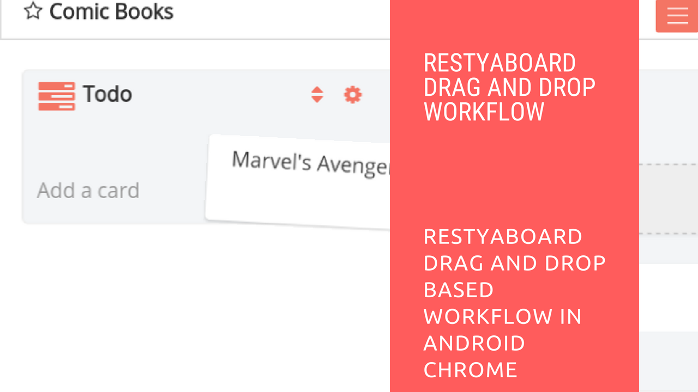

# Restyaboard Drag and Drop Based Workflow in Android Chrome

## Introduction

[Restyaboard](https://restya.com/board) is an open source alternative to Trello, but with smart additional features like offline sync, diff /revisions, nested comments, multiple view layouts, chat, and more. And since it is self-hosted, data, privacy, and IP security can be guaranteed.

Restyaboard is more like an electronic sticky note for organizing tasks and todos. Apart from this, it is ideal for Kanban, Agile, Gemba board and business process/workflow management. It can be extended with [productive plugins](https://restya.com/board/apps "productive plugins")

Today, several universities, automobile companies, government organizations, etc from across Europe take advantage of Restyaboard.

This document contains information about Restyaboard Drag and Drop Based Workflow in Android Chrome.

### What you'll learn

*   How to use your Restyaboard in Drag and Drop Based Workflow

## Video Tutorial

For step-by-step instructions on Restyaboard Drag and Drop Based Workflow in Android Chrome, refer [YouTube video](https://www.youtube.com/watch?v=8QCOeMWZtqI "Watch video on Restyaboard Drag and Drop Based Workflow in Android Chrome")

## Restyaboard Drag and Drop Based Workflow in Android Chrome

1.  Click the `Restyaboard Bookmark` in the `Home screen` and the Restyaboard link will open in the browser.
2.  Login with `User Credentials` and you can add a list to the particular board.
3.  If there is a change in the status of the work, you can move the cards among the lists eg., moving a card named `Marvel AVengers` from Todo list to Doing list