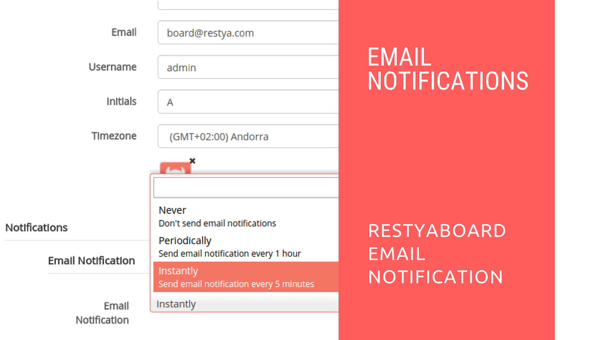

# Restyaboard Email Notification

## Introduction

[Restyaboard](https://restya.com/board) is an open source alternative to Trello, but with smart additional features like offline sync, diff /revisions, nested comments, multiple view layouts, chat, and more. And since it is self-hosted, data, privacy, and IP security can be guaranteed.

Restyaboard is more like an electronic sticky note for organizing tasks and todos. Apart from this, it is ideal for Kanban, Agile, Gemba board and business process/workflow management. It can be extended with [productive plugins](https://restya.com/board/apps "productive plugins")

Today, several universities, automobile companies, government organizations, etc from across Europe take advantage of Restyaboard.

This document contains information about how to use email notification in Restyaboard.

### What you'll learn

*   How to use Email Notification in Restyaboard?

## Video Tutorial

For step-by-step instructions on Restyaboard Email Notification, refer [YouTube video](https://www.youtube.com/watch?v=OCQyDwcB5S8 "Watch video on Restyaboard Email Notification")

## Restyaboard Email Notification

1.  After login, goto profile page and you can select the one option of instant, periodical, never for Email Notification
2.  If you are subscribed to the board, if there is any activities in the board, you will get the email notification about the activities in the board
3.  You can also subscribe to a particular card or particular list and you will get the email notification about the activities in the card or list.