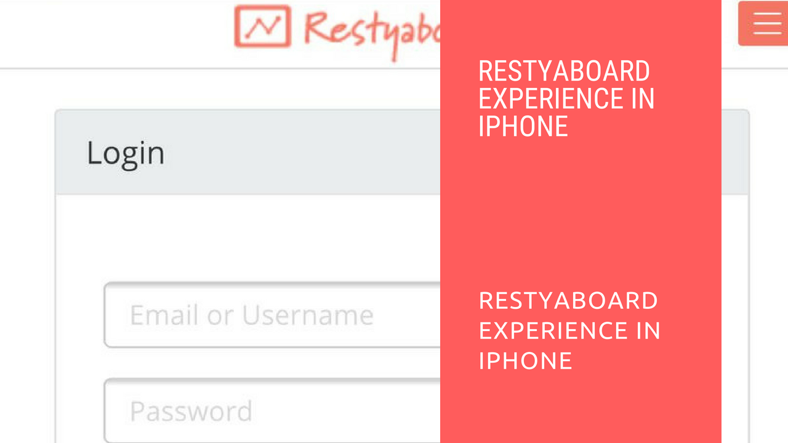

# Restyaboard Experience in iPhone

## Introduction

[Restyaboard](https://restya.com/board) is an open source alternative to Trello, but with smart additional features like offline sync, diff /revisions, nested comments, multiple view layouts, chat, and more. And since it is self-hosted, data, privacy, and IP security can be guaranteed.

Restyaboard is more like an electronic sticky note for organizing tasks and todos. Apart from this, it is ideal for Kanban, Agile, Gemba board and business process/workflow management. It can be extended with [productive plugins](https://restya.com/board/apps "productive plugins")

Today, several universities, automobile companies, government organizations, etc from across Europe take advantage of Restyaboard.

This document contains information about how to access your Restyaboard in iPhone.

### What you'll learn

*   How to access your Restyaboard in iPhone?

## Video Tutorial

For step-by-step instructions on Restyaboard Experience in iPhone, refer [YouTube video](https://www.youtube.com/watch?v=y-MMlmmHUEM "Watch video on Restyaboard Experience in iPhone")

## Restyaboard Experience in iPhone

1.  Click the `Restyaboard Bookmark` in the `Home screen` and the Restyaboard link will open in the browser.
2.  Login with `User Credentials` and you can add a list to the particular board.
3.  You can drag the card among the lists in boards for changes according to the Workflow eg., moving a card from todo list to done list