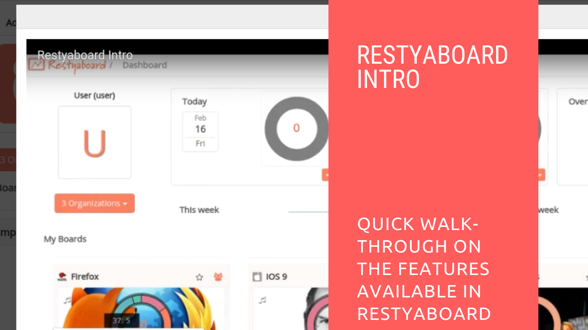

# Restyaboard Introduction

## Introduction

[Restyaboard](https://restya.com/board) is an open source alternative to Trello, but with smart additional features like offline sync, diff /revisions, nested comments, multiple view layouts, chat, and more. And since it is self-hosted, data, privacy, and IP security can be guaranteed.

Restyaboard is more like an electronic sticky note for organizing tasks and todos. Apart from this, it is ideal for Kanban, Agile, Gemba board and business process/workflow management. It can be extended with [productive plugins](https://restya.com/board/apps "productive plugins")

Today, several universities, automobile companies, government organizations, etc from across Europe take advantage of Restyaboard.

### What you'll learn

*   How to use Restyaboard in effective way?

## Video Tutorial

For step-by-step instructions on Restyaboard Introduction, refer [YouTube video](https://www.youtube.com/watch?v=GD8Nmi1600U "Watch video on Restyaboard Introduction")

## Restyaboard Introduction

1.  After login, you can create the board with template options.
2.  You can create the card in any one of the lists in the board page.
3.  You can add labels to the card, add members to the card, add start date, due date to the card.
4.  You can also add the description, checklists, color, attachment, comment to the card.
5.  You can also move, copy,archive the card.
6.  You can able to change the board background.
7.  You can view the video in the link below.
    
    [Restyaboard Introduction](https://www.youtube.com/watch?v=GD8Nmi1600U)