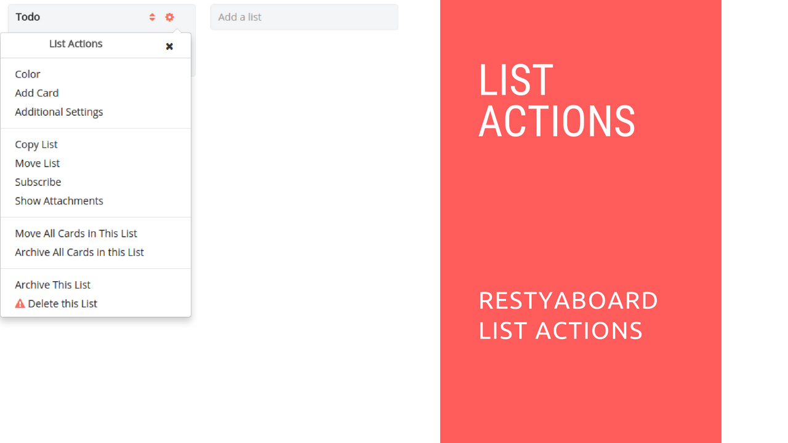

# Restyaboard List Actions

## Introduction

[Restyaboard](https://restya.com/board) is an open source alternative to Trello, but with smart additional features like offline sync, diff /revisions, nested comments, multiple view layouts, chat, and more. And since it is self-hosted, data, privacy, and IP security can be guaranteed.

Restyaboard is more like an electronic sticky note for organizing tasks and todos. Apart from this, it is ideal for Kanban, Agile, Gemba board and business process/workflow management. It can be extended with [productive plugins](https://restya.com/board/apps "productive plugins")

Today, several universities, automobile companies, government organizations, etc from across Europe take advantage of Restyaboard.

This document contains information about how to use Restyaboard list options.

### What you'll learn

*   How to use Restyaboard List Options

## Video Tutorial

For step-by-step instructions on Restyaboard List Actions, refer [YouTube video](https://www.youtube.com/watch?v=2H0lZ6PDcsg "Watch video on Restyaboard List Actions")

  

## Restyaboard List Actions

1.  Please goto any board page.
2.  Please click `Settings icon` in the list header for opening the list actions and you can perform the list actions if you have permission
3.  In list actions, there are options available for adding color to list, adding card to list, moving cards from current list to other lists and copy cards from current list to other lists, etc.,