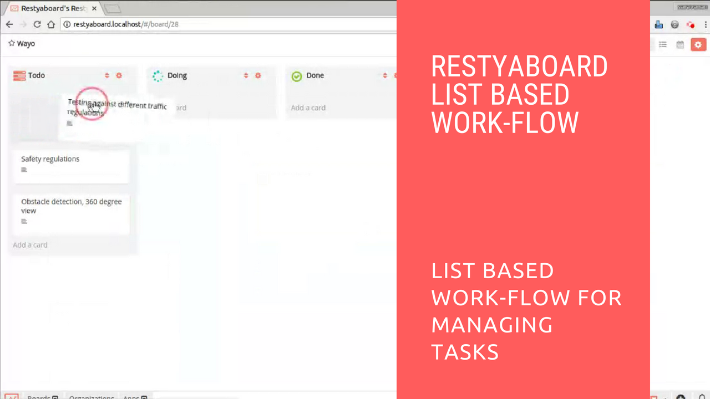

# Restyaboard in list based workflow

## Introduction

[Restyaboard](https://restya.com/board) is an open source alternative to Trello, but with smart additional features like offline sync, diff /revisions, nested comments, multiple view layouts, chat, and more. And since it is self-hosted, data, privacy, and IP security can be guaranteed.

Restyaboard is more like an electronic sticky note for organizing tasks and todos. Apart from this, it is ideal for Kanban, Agile, Gemba board and business process/workflow management. It can be extended with [productive plugins](https://restya.com/board/apps "productive plugins")

Today, several universities, automobile companies, government organizations, etc from across Europe take advantage of Restyaboard.

This document is a step-by-step guide that illustrates how to use Restyaboard in List Based Workflow.

### What you'll learn

*   How to use Restyaboard in list Based Workflow

## Video Tutorial

For step-by-step instructions on Restyaboard in List Based Workflow, refer [YouTube video](https://www.youtube.com/watch?v=7oXfMNRANx8 "Watch video on Restyaboard in List Based Workflow")

## Instructions for using restyaboard in list based workflow

Mostly all projects have some tasks and we are going to show how to use Restyaboard in “List Based Workflow” for managing your tasks.

1.  Add the lists named `TODO`, `DOING`, `DONE`.
2.  You can add the tasks in the list `TODO` which have to be queued or pipelined.
3.  You can move the tasks from list `TODO` to list `DOING` if you are going to start the tasks and you can set the due date for those tasks.
4.  You can move the tasks from list `DOING` to list `DONE` if the tasks are finished.

