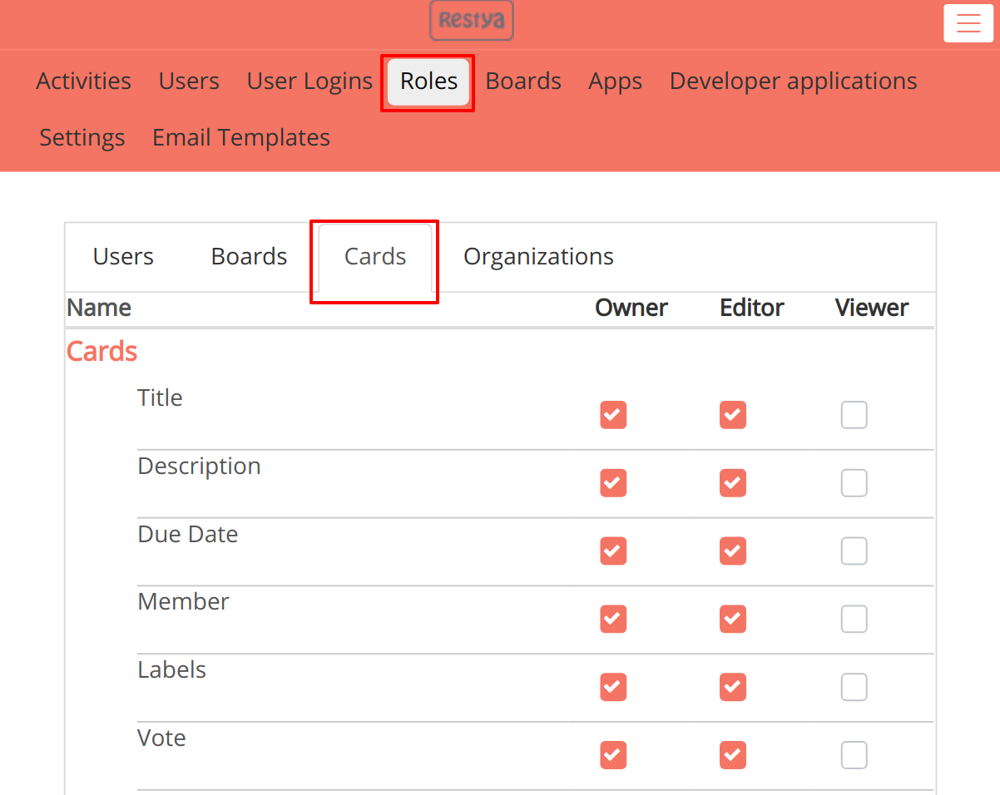
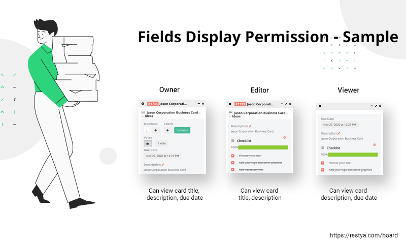

# Manage Cards Fields Display Permission For Board User Roles from Admin Panel

## Introduction

#### Set up permissions to view particular card fields

In the card view, you can control the card fields visibility to the members of the board by the `Role Management`.

In this permission management, you can control which board user roles can view the card fields by selecting the list of card field to be shown on the card page.

On the [Restyaboard](https://restya.com/board) admin panel roles page, we are adding the cards tab, in which you can choose the card fields which you want to be shown to the specific board user role and for which board user role you don't want to show the card fields.

## Configure Permission on the Roles Management

*   In the header of the `Admin Panel`, please click the `Roles` link to configure the permission into your Restyaboard site. You can manage the card fields display permission for the board user roles by clicking the `Cards` tab.
    
    

## Cards Fields Display Permission - Sample

*   After configuring the card fields permission for the Roles, the card fields will show to each board user role like the below sample image.
    
    
    
*   After changing the permission for the `Owner` board user role, if the user who is having the owner board user roles opens the cards, the card fields will display like the above sample image.
    
*   After changing the permission for the `Editor` board user role, if the user who is having the editor board user roles opens the cards, the cards fields will display like the above sample image.
    
*   After changing the permission for the `Viewer` board user role, if the user who is having the viewer board user roles opens the cards, the cards fields will display like the below image.