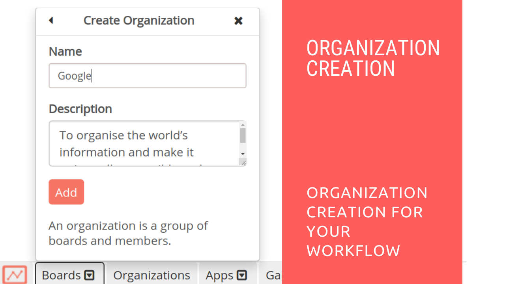

# Organization Creation in Restyaboard

## Introduction

[Restyaboard](https://restya.com/board) is an open source alternative to Trello, but with smart additional features like offline sync, diff /revisions, nested comments, multiple view layouts, chat, and more. And since it is self-hosted, data, privacy, and IP security can be guaranteed.

Restyaboard is more like an electronic sticky note for organizing tasks and todos. Apart from this, it is ideal for Kanban, Agile, Gemba board and business process/workflow management. It can be extended with [productive plugins](https://restya.com/board/apps "productive plugins")

Today, several universities, automobile companies, government organizations, etc from across Europe take advantage of Restyaboard.

This document contains information about how to create an organization in Restyaboard.

### What you'll learn

*   How to Create an Organization in Restyaboard

## Video Tutorial

For step-by-step instructions on Organization Creation in Restyaboard, refer [YouTube video](https://www.youtube.com/watch?v=yoTXh1BOXIo "Watch video on Organization Creation in Restyaboard")

  

## Organization Creation in Restyaboard

1.  For creating an orgnization, goto your Restyaboard login page and sign in with user credentials.
2.  After login, click the boards option in the footer and click the "Add Board or Organization" option in the boards dropdown menu.
3.  Select the "New Organization" option for adding a new organization.
4.  Add a new organization by filling the form with organization name and description and submit the form.
5.  After submitting the form, it will create an organization and redirects you to the created organization page.