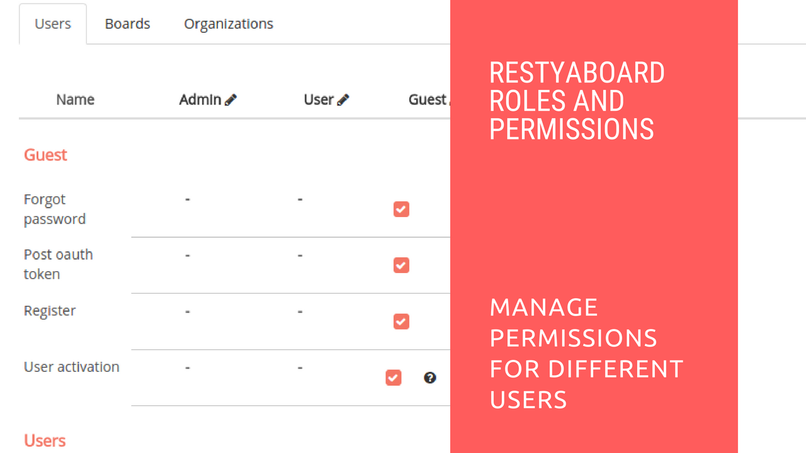

#  Configuration of Permissions and Roles

## Introduction

[Restyaboard](https://restya.com/board) is an open source alternative to Trello, but with smart additional features like offline sync, diff /revisions, nested comments, multiple view layouts, chat, and more. And since it is self-hosted, data, privacy, and IP security can be guaranteed.

Restyaboard is more like an electronic sticky note for organizing tasks and todos. Apart from this, it is ideal for Kanban, Agile, Gemba board and business process/workflow management. It can be extended with [productive plugins](https://restya.com/board/apps "productive plugins")

Today, several universities, automobile companies, government organizations, etc from across Europe take advantage of Restyaboard.

This document contains information about how to configure permissions and roles in Restyaboard.

### What you'll learn

*   How to configure Permissions and Roles in Restyaboard?

## Video Tutorial

For step-by-step instructions on Configuration of Permissions and Roles, refer [YouTube video](https://www.youtube.com/watch?v=Xka6E756iLY "Watch video on Configuration of Permissions and Roles")

## Configuration of Permissions and Roles

1.  After login as admin, click the Admin button and click `Roles` option.
2.  You can change the permission for `Add board` in the `Users` tab and in the `Boards` tab, you can change the permissions to the board roles of the users such as `Add card`, `Edit/Delete Labels` , etc.,
3.  In the `organizations` tab of the `Roles` option, you can change the permission of the organization roles assigned to the users
4.  You can change the user roles in the users listing page by selecting the roles from the roles option in the users listing page. 