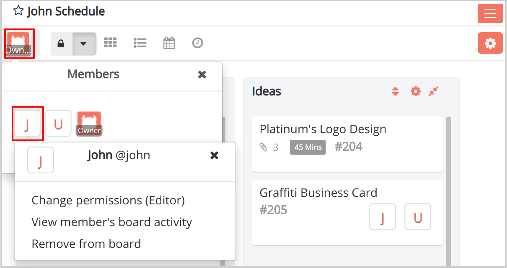
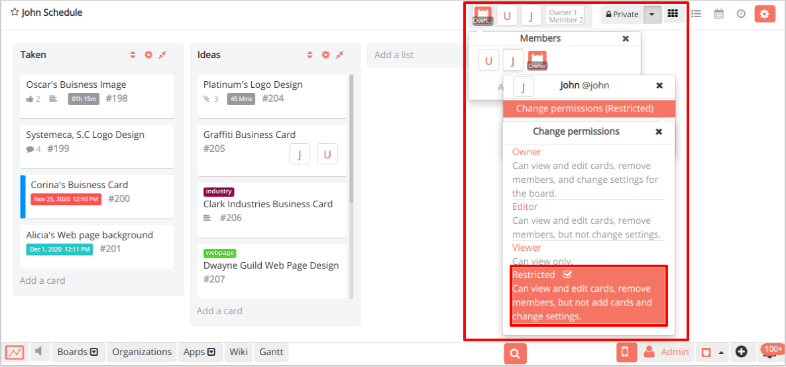
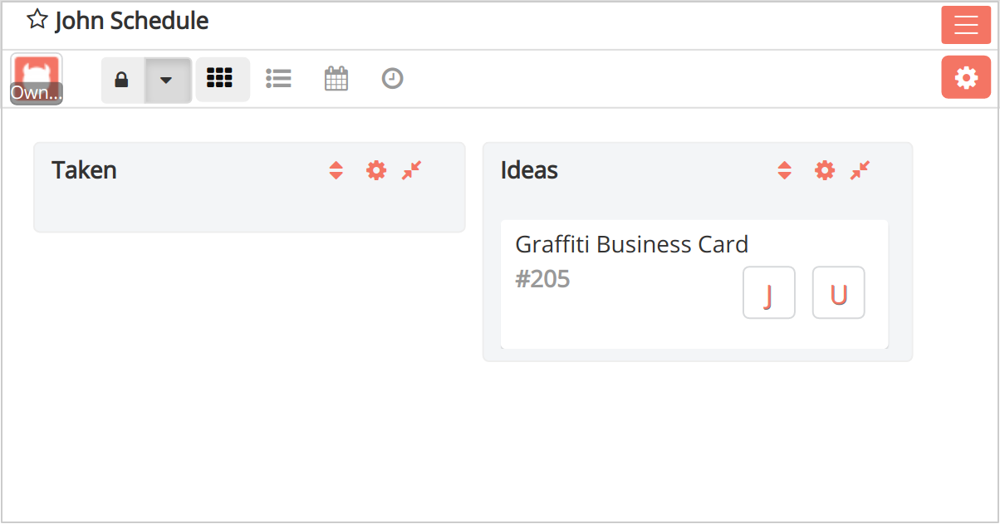

# Set up permissions to show assigned cards only in Restyaboard

## Introduction

#### Set up permissions to show assigned cards only

Usually, members of the board can view all cards in the board that they have access to. But, in certain enterprises with limited access, users should be given access to only the assigned cards. So, here we’re going to set up such permissions and access restrictions. Using the board user roles, we can enforce such permissions and restrictions.

#### Protect Sensitive Information

Do you have sensitive information on the card on the board that you want to show only to the assigned users of the card? Using the board user roles, we can enforce such permissions for changing the permissions of the user to view only assigned cards on the board, and you can set Restricted board user role to the members.

There are no limits to how many Restricted user role can be assigned to the board members on the board.

## Set up permissions to show assigned cards only

*   Board user roles settings let you decide what people can (and can't) do inside of the board, list, and card. We have added the new board user role called `Restricted`, which allow users to view only assigned cards on the board.
    
    Board User roles also play a part in what actions a person has available on a board!
    
*   To change a current board member's role to `Restricted`, click their avatar from the Members section of the board menu.
    
    
*   Select `Change Permissions` and select `Restricted`. Please note that only the board member who has the `Owner` role can change a board member's permissions.
    
    

## Restricted User Role Cards

#### Control cards visibility with Restricted board user role

Restricted board user role controls the card visibility for users inside the board, it will only show the assigned cards to the user, and it will also restrict the users from adding the card.

## Restricted User Role Use Cases

#### Education

*   In an online course, if the teacher wants the students to view only their assigned cards and restrict the add card permission, they can assign the Restricted board user roles to the students, and they will be only viewing the assigned cards.

#### Project Management

*   In an enterprise, if you want to restrict the employees to view only their assigned cards and restrict them from adding the cards, you can assign the Restricted board user roles to the employees, and they will be only viewing the assigned cards.